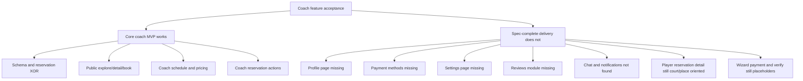

# Coach Feature Acceptance Audit

## Goal

Deepen the earlier review by checking the implementation against the explicit acceptance direction in `specs/coach-feature/PROMPT.md`.

## Important Note About Missing Planning References

The spec points to prior planning artifacts at `.agents/planning/2026-03-14-coach-feature/`, but that directory is not present in this repository snapshot.

- Expected reference from spec: `specs/coach-feature/PROMPT.md:175`
- Actual repo state: only `.agents/planning/2026-03-15-coach-feature-review/` exists

That means this audit can compare against the spec prompt, but not the referenced earlier design/plan files.

## Acceptance-Oriented Findings

### 1. Public coach discovery and booking

Status: **mostly implemented**

- `/coaches` explore flow exists.
- Location routes exist.
- `/coaches/{slug}` detail page exists.
- `/coaches/{slug}/book` booking page exists.
- `reservation.createForCoach` exists and calls coach reservation service.

Gaps inside this area:

- The detail page currently renders hero/about/qualifications/services/contact, but not the full availability-and-reviews surface expected by spec.
- Booking page fetches availability successfully, but selected add-ons are fetched and not surfaced as an actual user choice flow.

### 2. Coach setup wizard

Status: **partially implemented**

- Wizard shell exists and uses setup-status progression.
- Schedule and pricing steps mount real editors.
- Setup status tracks profile, sports, location, schedule, pricing, payment, and verification flags.

Gaps:

- Payment step is an explicit placeholder.
- Verification step is an explicit placeholder, and `hasVerification` is effectively satisfied by default in tests/use-case behavior.
- This means the wizard shape exists, but not all promised steps are truly functional.

### 3. Coach schedule and pricing tools

Status: **implemented**

- Coach hours, blocks, rate rules, and add-ons have routers, services, hooks, UI, and tests.
- This is one of the strongest completed parts of the coach feature.

### 4. Coach portal completeness

Status: **incomplete**

Implemented:

- dashboard
- get-started
- schedule
- pricing
- reservations list
- reservation detail

Missing:

- profile page route
- payment methods page route
- settings page route

The spec requires these to be functional, but current implementation and portal copy both indicate they are not complete.

### 5. Coach payment methods

Status: **schema-only / missing module**

- `coach_payment_method` table exists.
- Setup repository already checks for active coach payment methods.

But:

- no coach payment service/router/module was found
- no coach payment management UI was found
- player payment-info path still uses organization payment methods from court reservations

This is a critical mismatch because payment method readiness is part of setup completion but the feature to manage payment methods is absent.

### 6. Coach reviews

Status: **schema-only / missing module**

- `coach_review` table exists.
- Coach discovery meta can aggregate rating/review counts via repository queries.

But:

- no coach review module exists
- no public reviews section exists on the coach detail page
- no protected review submission/removal flow was found

So aggregate review metadata appears structurally prepared, but the review product surface is not complete.

### 7. Player reservation detail compatibility

Status: **likely not adapted for coach reservations**

Evidence:

- `src/features/reservation/pages/reservation-detail-page.tsx` assumes `courtRecord` and `placeRecord` must exist.
- `src/lib/modules/reservation/services/reservation.service.ts` payment-info and detail logic still resolve via court and place repositories.

Implication:

- a coach reservation may be creatable, but the player-side reservation detail and payment info path still appears designed around court/place bookings, not coach bookings.

### 8. Notifications and chat

Status: **not found**

- coach reservation service logs events like `coach_reservation.created`, `coach_reservation.accepted`, etc.
- repo search did not find coach-specific notification template implementation in notification-delivery modules
- repo search did not find coach-specific chat-channel creation such as `createCoachReservationChannel`

Implication:

- lifecycle logging exists, but the richer notification/chat acceptance criteria do not appear implemented.

## Acceptance Snapshot

## Updated Verdict

If the evaluation question is:

- "Did we successfully launch a coach MVP?" -> **mostly yes**
- "Did we complete the coach feature described in the spec?" -> **no**

The most accurate framing is:

> The coach feature is successful as a partial MVP release, but missing several promised capabilities and therefore incomplete against its stated acceptance criteria.

## Useful Next Move If Needed Later

If you want, the next pass should convert this audit into a crisp implementation backlog grouped as:

- P0: broken or misleading end-to-end gaps
- P1: missing spec commitments
- P2: polish and coverage improvements
