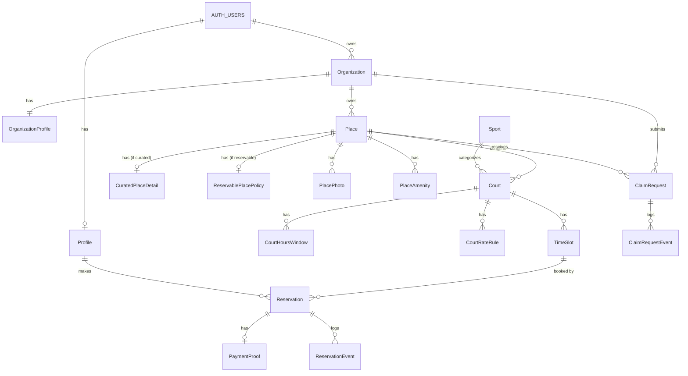

# KudosCourts MVP - Database Design & Technical Specification

**Version:** 1.2  
**Last Updated:** January 12, 2026  
**Status:** Draft

---

## Table of Contents

1. [Overview](#1-overview)
2. [Terminology (v1.2)](#2-terminology-v12)
3. [Design Decisions & Rationale](#3-design-decisions--rationale)
4. [Entity Relationship Diagram](#4-entity-relationship-diagram)
5. [Detailed Entity Definitions](#5-detailed-entity-definitions)
6. [State Machines & Transitions](#6-state-machines--transitions)
7. [Feature Flows](#7-feature-flows)
8. [Business Rules & Constraints](#8-business-rules--constraints)
9. [Repository Layer Guidelines](#9-repository-layer-guidelines)
10. [Indexes & Performance Considerations](#10-indexes--performance-considerations)

---

## 1. Overview

### 1.1 Purpose

This document defines the target database schema and business constraints for KudosCourts MVP.

### 1.2 Scope

The MVP supports:
- Place discovery by location (both curated and reservable listings)
- Reservation flow for free and paid bookings
- P2P-style payment confirmation (no payment processing)
- Place claiming workflow for curated listings
- Multi-tenant organization support
- Multi-sport at the venue level (a place can contain courts for different sports)

### 1.3 Technology Stack

- **Database:** PostgreSQL (via Supabase)
- **Authentication:** Supabase Auth (`auth.users`)
- **Currency:** Multi-currency support (ISO 4217)

### 1.4 Contract References

Reservation behavior is a contract documented here:
- `docs/reservation-state-machine.md`
- `docs/reservation-state-machine-level-1-product.md`
- `docs/reservation-state-machine-level-2-engineering.md`

This ERD spec must match that contract.

---

## 2. Terminology (v1.2)

This version introduces explicit naming to avoid the “location vs court” ambiguity:

- **Place**: a physical venue/location listing (name/address/lat/lng, media, amenities, claiming).
- **Court**: a single bookable unit inside a place (e.g., “Court 3”).
- **Sport**: a sport dimension (basketball, pickleball, etc.). Constraint: **1 court = 1 sport**.
- **Time Slot**: a bookable time period for a specific court.

Key v1.2 product requirements represented in the model:
- A place can have **N** courts.
- Players can choose a **specific court** or choose **Any available court**.
- Court operating hours are **day-specific** and can include **overnight** availability.
- Pricing is **per hour** and varies by **day-of-week + time window**.
- Minimum slot/booking granularity is **60 minutes**.

---

## 3. Design Decisions & Rationale

### 3.1 Place vs Court (Unit) Modeling

**Decision:** Split “location listing” from “bookable unit”.

- `Place` is the listing/discovery unit and the object that is curated/claimed.
- `Court` is the inventory unit that owns hours, pricing, and time slots.

**Rationale:**
- Real venues have multiple courts.
- A venue can contain courts for different sports.
- Booking must target a specific physical unit for conflict-free scheduling.

### 3.2 Curated vs Reservable

**Decision:** Curated vs Reservable applies to **Place**.

**Rationale:**
- Claiming is a listing-level action (the place gets claimed).
- Once claimed/reservable, the organization manages courts inside the place.

### 3.3 Place-Level Payment Policy

**Decision:** Payment instructions/policy live at the `Place` level (shared by all courts at the venue).

**Rationale:**
- Simplifies operations for owners and UX for players.
- Avoids duplicating payment destinations across courts at the same venue.

### 3.4 Court-Level Hours (Day Specific, Overnight Supported)

**Decision:** Court hours are stored as multiple windows per day.

**Modeling approach:**
- Store windows as `dayOfWeek + startMinute + endMinute`.
- Overnight hours are represented by splitting into two windows across two days.

**Rationale:**
- Supports breaks (multiple windows/day).
- Supports overnight without allowing “endMinute < startMinute” complexity.

### 3.5 Pricing Model (Hourly Rules + Slot Materialization)

**Decision:** Store hourly pricing rules per court and day/time window, and materialize a total `priceCents` on each `TimeSlot`.

**Rationale:**
- `TimeSlot` needs a single price for display and booking.
- Hourly rules allow owners to express morning/afternoon/evening pricing.
- 60-minute granularity keeps the computation simple and predictable.

### 3.6 Slot Management

**Decision:** Explicit slots remain the inventory primitive.

**Rationale:**
- Simple availability queries.
- Simple transactional booking: lock one slot row.
- Works well with “Any available” (pick one slot among many).

### 3.7 Slot Duration & Granularity

**Decision:** Slots and booking durations are in **multiples of 60 minutes**.

**Rationale:**
- Matches product requirement.
- Keeps pricing computation consistent with hourly rates.

### 3.8 Slot Overlap Prevention

**Decision:** Enforce overlap prevention in repository/service layer (with the option to add exclusion constraints later).

**Rationale:**
- Better control over error messaging.
- Preserves existing architecture approach.

### 3.9 Audit Trail

**Decision:** Separate event tables for reservations and claim requests.

**Rationale:**
- Full accountability and debugging.
- Dispute resolution and operational support.

---

## 4. Entity Relationship Diagram

### 4.1 High-Level Diagram

```
┌─────────────────────────────────────────────────────────────────────────────┐
│                         SUPABASE AUTH (auth.users)                          │
└─────────────────────────────────────────────────────────────────────────────┘
                                      │
           ┌──────────────────────────┼──────────────────────────┐
           ▼                          ▼                          ▼
    ┌──────────┐              ┌──────────────┐            ┌───────────┐
    │ Profile  │              │ Organization │            │   Admin   │
    │ (Player) │              │   (Tenant)   │            │ (future)  │
    └──────────┘              └──────┬───────┘            └───────────┘
           │                         │
           │                         ▼
           │               ┌───────────────────┐
           │               │OrganizationProfile│
           │               └───────────────────┘
           │                         │
           │                         ▼
           │                    ┌─────────┐
           │                    │  Place  │  (Listing)
           │                    └────┬────┘
           │                         │
           │          ┌──────────────┼───────────────────┐
           │          ▼              ▼                   ▼
           │   ┌─────────────┐  ┌──────────────┐  ┌──────────────┐
           │   │ CuratedPlace │  │ Reservable   │  │ Place media  │
           │   │   Detail     │  │ Place Policy │  │ (photos/etc) │
           │   └─────────────┘  └──────────────┘  └──────────────┘
           │                         │
           │                         ▼
           │                    ┌─────────┐
           │                    │  Court  │  (Unit)
           │                    └────┬────┘
           │                         │
           │          ┌──────────────┼───────────────────────────────┐
           │          ▼              ▼                               ▼
           │   ┌────────────┐  ┌──────────────┐               ┌──────────┐
           │   │Court Hours │  │Court RateRule│               │ TimeSlot │
           │   └────────────┘  └──────────────┘               └────┬─────┘
           │                                                        │
           └──────────────────────────────┬─────────────────────────┘
                                          ▼
                                   ┌─────────────┐      ┌─────────────────┐
                                   │ Reservation  │──────│  PaymentProof   │
                                   └──────┬───────┘      └─────────────────┘
                                          │
                                          ▼
                                ┌──────────────────┐    ┌──────────────────┐
                                │ ReservationEvent │    │   ClaimRequest   │
                                │   (Audit Log)    │    └────────┬─────────┘
                                └──────────────────┘             │
                                                                   ▼
                                                        ┌────────────────────┐
                                                        │ ClaimRequestEvent  │
                                                        │    (Audit Log)     │
                                                        └────────────────────┘

                 ┌─────────┐
                 │  Sport  │
                 └────┬────┘
                      │
                      └────────────── (Court belongs to Sport)
```

### 4.2 Mermaid Diagram



---

## 5. Detailed Entity Definitions

### 5.1 Profile (Player)

Links Supabase auth users to player-specific data.

| Column | Type | Constraints | Notes |
|--------|------|-------------|-------|
| id | UUID | PK | |
| user_id | UUID | FK → auth.users, UNIQUE, NOT NULL | Links to Supabase auth |
| display_name | VARCHAR(100) | NULL | Optional friendly name |
| email | VARCHAR(255) | NULL | Contact email (may differ from auth) |
| phone_number | VARCHAR(20) | NULL | For contact purposes |
| avatar_url | TEXT | NULL | Profile picture |
| created_at | TIMESTAMPTZ | NOT NULL | |
| updated_at | TIMESTAMPTZ | NOT NULL | |

---

### 5.2 Organization

Represents a venue owner/operator entity.

| Column | Type | Constraints | Notes |
|--------|------|-------------|-------|
| id | UUID | PK | |
| owner_user_id | UUID | FK → auth.users, NOT NULL | Organization owner |
| name | VARCHAR(150) | NOT NULL | Display name |
| slug | VARCHAR(100) | UNIQUE, NOT NULL | URL-friendly identifier |
| is_active | BOOLEAN | NOT NULL, DEFAULT true | Soft disable |
| created_at | TIMESTAMPTZ | NOT NULL | |
| updated_at | TIMESTAMPTZ | NOT NULL | |

---

### 5.3 OrganizationProfile

Extended profile information for organizations.

| Column | Type | Constraints | Notes |
|--------|------|-------------|-------|
| id | UUID | PK | |
| organization_id | UUID | FK → Organization, UNIQUE, NOT NULL | 1:1 relationship |
| description | TEXT | NULL | About the organization |
| logo_url | TEXT | NULL | Organization logo |
| contact_email | VARCHAR(255) | NULL | Public contact email |
| contact_phone | VARCHAR(20) | NULL | Public contact phone |
| address | TEXT | NULL | Business address |
| created_at | TIMESTAMPTZ | NOT NULL | |
| updated_at | TIMESTAMPTZ | NOT NULL | |

---

### 5.4 Place (Base Listing Entity)

A physical venue/location listing.

| Column | Type | Constraints | Notes |
|--------|------|-------------|-------|
| id | UUID | PK | |
| organization_id | UUID | FK → Organization, NULL | NULL = unclaimed curated listing |
| name | VARCHAR(200) | NOT NULL | Place name |
| address | TEXT | NOT NULL | Full address |
| city | VARCHAR(100) | NOT NULL | For search/filtering |
| latitude | DECIMAL(10, 8) | NOT NULL | GPS coordinate |
| longitude | DECIMAL(11, 8) | NOT NULL | GPS coordinate |
| time_zone | VARCHAR(64) | NOT NULL | IANA time zone (e.g. Asia/Manila) |
| place_type | VARCHAR(20) | NOT NULL | `CURATED` or `RESERVABLE` |
| claim_status | VARCHAR(20) | NOT NULL | UNCLAIMED / CLAIM_PENDING / CLAIMED / REMOVAL_REQUESTED |
| is_active | BOOLEAN | NOT NULL, DEFAULT true | Visibility toggle |
| created_at | TIMESTAMPTZ | NOT NULL | |
| updated_at | TIMESTAMPTZ | NOT NULL | |

---

### 5.5 CuratedPlaceDetail (Subclass)

Additional details for manually curated (view-only) listings.

| Column | Type | Constraints | Notes |
|--------|------|-------------|-------|
| id | UUID | PK | |
| place_id | UUID | FK → Place, UNIQUE, NOT NULL | 1:1 with base |
| facebook_url | TEXT | NULL | |
| viber_info | VARCHAR(100) | NULL | |
| instagram_url | TEXT | NULL | |
| website_url | TEXT | NULL | |
| other_contact_info | TEXT | NULL | |
| created_at | TIMESTAMPTZ | NOT NULL | |
| updated_at | TIMESTAMPTZ | NOT NULL | |

---

### 5.6 ReservablePlacePolicy (Subclass)

Place-wide payment/policy configuration.

| Column | Type | Constraints | Notes |
|--------|------|-------------|-------|
| id | UUID | PK | |
| place_id | UUID | FK → Place, UNIQUE, NOT NULL | 1:1 with base |
| requires_owner_confirmation | BOOLEAN | NOT NULL, DEFAULT true | Mutual confirmation flow |
| payment_hold_minutes | INT | NOT NULL, DEFAULT 15 | TTL window |
| owner_review_minutes | INT | NOT NULL, DEFAULT 15 | Owner review target (UX/ops) |
| cancellation_cutoff_minutes | INT | NOT NULL, DEFAULT 0 | Place-wide rule |
| payment_instructions | TEXT | NULL | |
| gcash_number | VARCHAR(20) | NULL | |
| bank_name | VARCHAR(100) | NULL | |
| bank_account_number | VARCHAR(50) | NULL | |
| bank_account_name | VARCHAR(150) | NULL | |
| created_at | TIMESTAMPTZ | NOT NULL | |
| updated_at | TIMESTAMPTZ | NOT NULL | |

---

### 5.7 Sport

Dimension table for sports.

| Column | Type | Constraints | Notes |
|--------|------|-------------|-------|
| id | UUID | PK | |
| slug | VARCHAR(50) | UNIQUE, NOT NULL | `pickleball`, `basketball`, etc |
| name | VARCHAR(100) | NOT NULL | Display name |
| created_at | TIMESTAMPTZ | NOT NULL | |
| updated_at | TIMESTAMPTZ | NOT NULL | |

---

### 5.8 Court (Unit)

A single bookable court unit inside a place.

| Column | Type | Constraints | Notes |
|--------|------|-------------|-------|
| id | UUID | PK | |
| place_id | UUID | FK → Place, NOT NULL | |
| sport_id | UUID | FK → Sport, NOT NULL | 1 court = 1 sport |
| label | VARCHAR(100) | NOT NULL | e.g. "Court 7" |
| tier_label | VARCHAR(20) | NULL | e.g. STANDARD/PREMIUM/DELUXE (label only) |
| is_active | BOOLEAN | NOT NULL, DEFAULT true | |

**Constraints:**
- `UNIQUE(place_id, label)`

---

### 5.9 CourtHoursWindow

Day-specific operating hours for a court, with support for multiple windows per day.

| Column | Type | Constraints | Notes |
|--------|------|-------------|-------|
| id | UUID | PK | |
| court_id | UUID | FK → Court, NOT NULL | |
| day_of_week | INT | NOT NULL | 0–6 |
| start_minute | INT | NOT NULL | 0–1439 |
| end_minute | INT | NOT NULL | 1–1440 |
| created_at | TIMESTAMPTZ | NOT NULL | |
| updated_at | TIMESTAMPTZ | NOT NULL | |

**Constraints:**
- `CHECK (day_of_week BETWEEN 0 AND 6)`
- `CHECK (start_minute >= 0 AND start_minute <= 1439)`
- `CHECK (end_minute >= 1 AND end_minute <= 1440)`
- `CHECK (start_minute < end_minute)`

**Overnight modeling:** split into 2 records across days.

---

### 5.10 CourtRateRule

Hourly pricing rules by day-of-week and time window.

| Column | Type | Constraints | Notes |
|--------|------|-------------|-------|
| id | UUID | PK | |
| court_id | UUID | FK → Court, NOT NULL | |
| day_of_week | INT | NOT NULL | 0–6 |
| start_minute | INT | NOT NULL | 0–1439 |
| end_minute | INT | NOT NULL | 1–1440 |
| currency | VARCHAR(3) | NOT NULL | ISO 4217 |
| hourly_rate_cents | INT | NOT NULL | Price per hour |
| created_at | TIMESTAMPTZ | NOT NULL | |
| updated_at | TIMESTAMPTZ | NOT NULL | |

**Constraints:**
- Same window constraints as `CourtHoursWindow`

**Notes:**
- Overlaps should be prevented by validation; if overlaps are allowed, a `priority` field is required.

---

### 5.11 TimeSlot

Bookable time slots for courts.

| Column | Type | Constraints | Notes |
|--------|------|-------------|-------|
| id | UUID | PK | |
| court_id | UUID | FK → Court, NOT NULL | Slot belongs to a specific court |
| start_time | TIMESTAMPTZ | NOT NULL | Slot start |
| end_time | TIMESTAMPTZ | NOT NULL | Slot end |
| status | VARCHAR(20) | NOT NULL, DEFAULT 'AVAILABLE' | AVAILABLE / HELD / BOOKED / BLOCKED |
| price_cents | INT | NULL | Total slot price; NULL = free |
| currency | VARCHAR(3) | NULL | Must be set iff price_cents set |
| created_at | TIMESTAMPTZ | NOT NULL | |
| updated_at | TIMESTAMPTZ | NOT NULL | |

**Constraints:**
- `CHECK (end_time > start_time)`
- `CHECK ((price_cents IS NULL AND currency IS NULL) OR (price_cents IS NOT NULL AND currency IS NOT NULL))`
- `UNIQUE (court_id, start_time)`
- Duration must be a multiple of 60 minutes (enforced at service layer)

---

### 5.12 Reservation

Booking record linking a player to a time slot.

| Column | Type | Constraints | Notes |
|--------|------|-------------|-------|
| id | UUID | PK | |
| time_slot_id | UUID | FK → TimeSlot, NOT NULL | |
| player_id | UUID | FK → Profile, NOT NULL | |
| player_name_snapshot | VARCHAR(100) | NULL | |
| player_email_snapshot | VARCHAR(255) | NULL | |
| player_phone_snapshot | VARCHAR(20) | NULL | |
| status | VARCHAR(30) | NOT NULL | CREATED/AWAITING_PAYMENT/PAYMENT_MARKED_BY_USER/CONFIRMED/EXPIRED/CANCELLED |
| expires_at | TIMESTAMPTZ | NULL | TTL deadline for active states |
| terms_accepted_at | TIMESTAMPTZ | NULL | When T&C acknowledged |
| confirmed_at | TIMESTAMPTZ | NULL | |
| cancelled_at | TIMESTAMPTZ | NULL | |
| cancellation_reason | TEXT | NULL | |
| created_at | TIMESTAMPTZ | NOT NULL | |
| updated_at | TIMESTAMPTZ | NOT NULL | |

---

### 5.13 PaymentProof

Optional payment proof uploaded by player.

| Column | Type | Constraints | Notes |
|--------|------|-------------|-------|
| id | UUID | PK | |
| reservation_id | UUID | FK → Reservation, UNIQUE, NOT NULL | 1:1 relationship |
| file_url | TEXT | NULL | |
| reference_number | VARCHAR(100) | NULL | |
| notes | TEXT | NULL | |
| created_at | TIMESTAMPTZ | NOT NULL | |

---

### 5.14 ReservationEvent (Audit Log)

Tracks all reservation status transitions.

| Column | Type | Constraints | Notes |
|--------|------|-------------|-------|
| id | UUID | PK | |
| reservation_id | UUID | FK → Reservation, NOT NULL | |
| from_status | VARCHAR(30) | NULL | NULL for initial creation |
| to_status | VARCHAR(30) | NOT NULL | |
| triggered_by_user_id | UUID | FK → auth.users, NULL | NULL if system-triggered |
| triggered_by_role | VARCHAR(20) | NOT NULL | PLAYER / OWNER / SYSTEM |
| notes | TEXT | NULL | |
| created_at | TIMESTAMPTZ | NOT NULL | |

---

### 5.15 ClaimRequest

Tracks requests to claim or remove curated places.

| Column | Type | Constraints | Notes |
|--------|------|-------------|-------|
| id | UUID | PK | |
| place_id | UUID | FK → Place, NOT NULL | Listing being claimed |
| organization_id | UUID | FK → Organization, NOT NULL | Requesting org |
| request_type | VARCHAR(20) | NOT NULL | CLAIM / REMOVAL |
| status | VARCHAR(20) | NOT NULL, DEFAULT 'PENDING' | PENDING/APPROVED/REJECTED |
| requested_by_user_id | UUID | FK → auth.users, NOT NULL | |
| reviewer_user_id | UUID | FK → auth.users, NULL | |
| reviewed_at | TIMESTAMPTZ | NULL | |
| request_notes | TEXT | NULL | |
| review_notes | TEXT | NULL | |
| created_at | TIMESTAMPTZ | NOT NULL | |
| updated_at | TIMESTAMPTZ | NOT NULL | |

---

### 5.16 ClaimRequestEvent (Audit Log)

Tracks all claim request status transitions.

| Column | Type | Constraints | Notes |
|--------|------|-------------|-------|
| id | UUID | PK | |
| claim_request_id | UUID | FK → ClaimRequest, NOT NULL | |
| from_status | VARCHAR(20) | NULL | NULL for initial creation |
| to_status | VARCHAR(20) | NOT NULL | |
| triggered_by_user_id | UUID | FK → auth.users, NOT NULL | |
| notes | TEXT | NULL | |
| created_at | TIMESTAMPTZ | NOT NULL | |

---

## 6. State Machines & Transitions

### 6.1 TimeSlot Status Transitions

```
                    ┌─────────────────────────────────────────┐
                    │                                         │
                    ▼                                         │
┌───────────┐    ┌──────┐    ┌────────┐                      │
│ AVAILABLE │───►│ HELD │───►│ BOOKED │                      │
└───────────┘    └──────┘    └────────┘                      │
      │              │                                        │
      │              │ (expired/cancelled/rejected)           │
      │              └────────────────────────────────────────┘
      │
      │         ┌─────────┐
      └────────►│ BLOCKED │
                └────┬────┘
                     │ (owner unblocks)
                     ▼
               ┌───────────┐
               │ AVAILABLE │
               └───────────┘
```

### 6.2 Reservation Status Transitions (Mutual Confirmation Contract)

This is the contract described in `docs/reservation-state-machine-level-2-engineering.md`.

- `CREATED` means: player requested booking, awaiting owner acceptance; slot held immediately.
- Owner acceptance is required for both free and paid.

#### Free Flow

```
┌─────────┐    ┌───────────┐
│ CREATED │───►│ CONFIRMED │
└─────────┘    └───────────┘
     │
     ├─────────────►┌───────────┐
     │              │ CANCELLED │
     │              └───────────┘
     └─────────────►┌─────────┐
                    │ EXPIRED │
                    └─────────┘
```

#### Paid Flow

```
┌─────────┐    ┌──────────────────┐    ┌───────────────────────┐    ┌───────────┐
│ CREATED │───►│ AWAITING_PAYMENT │───►│ PAYMENT_MARKED_BY_USER│───►│ CONFIRMED │
└─────────┘    └──────────────────┘    └───────────────────────┘    └───────────┘
     │                  │                        │
     ├─────────────►┌───────────┐                │
     │              │ CANCELLED │                │
     │              └───────────┘                │
     └─────────────►┌─────────┐                  │
                    │ EXPIRED │◄─────────────────┘
                    └─────────┘
```

**TTL rules (summary):**
- On `CREATED`: set `expires_at = now + 15 min` (owner acceptance window).
- On owner acceptance for paid: set `expires_at = now + 15 min` fresh payment window.
- On `PAYMENT_MARKED_BY_USER`: TTL does not extend.

---

## 7. Feature Flows

### 7.1 Discover a Curated Place (View-Only)

**Data flow:**
1. Query `Place` where `place_type = 'CURATED'` and location filters.
2. Join `CuratedPlaceDetail` for socials.
3. Join `PlacePhoto` and `PlaceAmenity` for display.

### 7.2 Reserve a Court (Free or Paid)

**Place detail page requirements:**
- Show list of courts at the place, each with its sport.
- Player chooses a specific court OR chooses “Any available”.

**Booking request transaction (contract):**
- Lock slot row.
- Transition slot `AVAILABLE` → `HELD`.
- Create reservation `CREATED` and set `expires_at` to owner acceptance TTL.

### 7.3 “Any Available Court” Selection

**Decision:** Auto-assign chooses one available slot among courts at a place.

**Recommended selection criteria:**
- Filter by: `place_id`, `sport_id`, desired start time.
- Pick the **cheapest** total slot price (ties broken by stable deterministic ordering).

**Concurrency requirement:**
- Selection + holding must be in a transaction to avoid double-holds.

---

## 8. Business Rules & Constraints

### 8.1 Place Rules

| Rule | Description |
|------|-------------|
| Place type | A place is either CURATED or RESERVABLE |
| Claiming prerequisites | Only CURATED places with UNCLAIMED can be claimed |
| Organization required | RESERVABLE places must have an organization_id |
| Time zone required | Place must have a time zone to interpret day-of-week rules |

### 8.2 Court Rules

| Rule | Description |
|------|-------------|
| Court belongs to place | Every court must belong to a place |
| Court has one sport | 1 court = 1 sport |
| Label uniqueness | No duplicate court labels within the same place |

### 8.3 Hours Rules

| Rule | Description |
|------|-------------|
| Day specific | Hours vary by day-of-week |
| Overnight | Represented by splitting into two day windows |
| Breaks | Multiple windows/day allowed |

### 8.4 Pricing Rules

| Rule | Description |
|------|-------------|
| Hourly | Pricing expressed as hourly rate per court |
| Day/time | Pricing varies by day-of-week + time window |
| Overlaps | Rate-rule overlaps should be prevented or require priority |
| Slot price materialization | Each slot has a total price/currency (or NULL = free) |

### 8.5 Slot Rules

| Rule | Description |
|------|-------------|
| Duration | Slot duration must be multiples of 60 minutes |
| No overlap | Slots for the same court cannot overlap |
| Price consistency | price_cents and currency must both be set or both NULL |

### 8.6 Reservation Rules

| Rule | Description |
|------|-------------|
| Mutual confirmation | All bookings require owner acceptance (CREATED state) |
| TTL | expires_at applies to CREATED / AWAITING_PAYMENT / PAYMENT_MARKED_BY_USER |
| Slot hold | Slot is held immediately when player requests |
| One slot per reservation | MVP maintains 1 reservation → 1 time_slot |

---

## 9. Repository Layer Guidelines

### 9.1 Overlap Prevention

Before creating a slot, validate no overlap:
- Same `court_id`
- `existing.start_time < new.end_time` AND `existing.end_time > new.start_time`

### 9.2 Slot Price Computation

For a slot of `N` hours (N is integer, 60-minute increments):
- Compute total price as the sum of hourly rates for each hour boundary within `[start_time, end_time)`.
- If any required hour is missing a pricing rule, the slot must not be published as AVAILABLE.

### 9.3 “Any Available” Selection

Implement as:
- Find candidate `TimeSlot` rows (AVAILABLE) for courts at a place + sport + start time.
- Choose cheapest.
- Lock and transition to HELD.

---

## 10. Indexes & Performance Considerations

### 10.1 Recommended Indexes

- Place discovery:
  - `(latitude, longitude)`
  - `(city)`
  - `(place_type)`
  - `(organization_id)` partial where not null
  - `(is_active)` partial where true

- Court filtering:
  - `(place_id)`
  - `(sport_id)`

- Time slot queries:
  - `(court_id, status)`
  - `(start_time)`
  - `(court_id, start_time)` partial where status = AVAILABLE

- Reservation queries:
  - `(player_id)`
  - `(status)`
  - `(expires_at)` partial where status in (CREATED, AWAITING_PAYMENT, PAYMENT_MARKED_BY_USER)

### 10.2 Data Retention

For MVP scale:
- Consider archiving time slots older than 90 days.

---

## Revision History

| Version | Date | Author | Changes |
|---------|------|--------|---------|
| 1.2 | 2026-01-12 | - | Migrated ERD from Court-as-location to Place + Court units; added sport, court hours windows, court rate rules, 60-min granularity, any-available selection; aligned reservation flow to mutual confirmation contract |

*End of Document*
