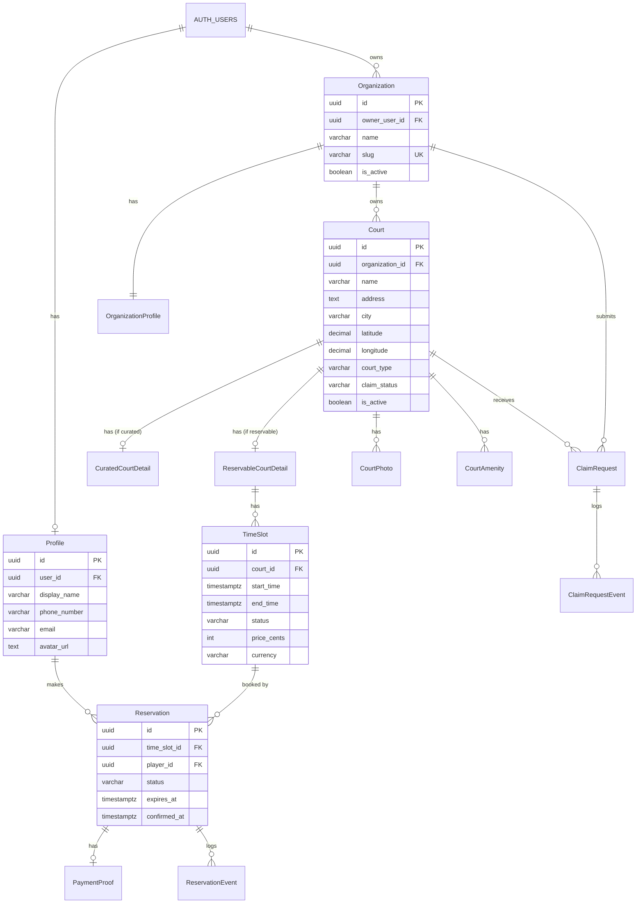

# KudosCourts MVP - Database Design & Technical Specification

## Table of Contents

1. [Overview](#1-overview)
2. [Design Decisions & Rationale](#2-design-decisions--rationale)
3. [Entity Relationship Diagram](#3-entity-relationship-diagram)
4. [Detailed Entity Definitions](#4-detailed-entity-definitions)
5. [State Machines & Transitions](#5-state-machines--transitions)
6. [Feature Flows](#6-feature-flows)
7. [Business Rules & Constraints](#7-business-rules--constraints)
8. [Repository Layer Guidelines](#8-repository-layer-guidelines)
9. [Indexes & Performance Considerations](#9-indexes--performance-considerations)

---

## 1. Overview

### 1.1 Purpose

This document defines the database schema and business logic for KudosCourts MVP - a player-first, location-based pickleball court discovery and reservation platform.

### 1.2 Scope

The MVP supports:
- Court discovery by location (both curated and reservable courts)
- Reservation flow for free and paid courts
- P2P-style payment confirmation (no payment processing)
- Court claiming workflow for curated courts
- Multi-tenant organization support

### 1.3 Technology Stack

- **Database:** PostgreSQL (via Supabase)
- **Authentication:** Supabase Auth (auth.users)
- **Currency:** Multi-currency support (ISO 4217)

---

## 2. Design Decisions & Rationale

### 2.1 Court Type Modeling

**Decision:** Use a strong base entity (`Court`) with subclass tables (`CuratedCourtDetail`, `ReservableCourtDetail`).

**Rationale:**
- Allows shared attributes (name, location, photos, amenities) on the base entity
- Type-specific attributes isolated in subclass tables
- Supports the claiming flow where a curated court transitions to reservable
- Cleaner queries when filtering by court type

### 2.2 Curated Court Claiming Flow

**Decision:** Admin-approved claiming process with full audit trail.

**Flow:**
1. Organization submits claim request for a curated court
2. `ClaimRequest` created with status `PENDING`
3. Admin reviews and approves/rejects
4. On approval:
   - Court's `claim_status` → `CLAIMED`
   - Court's `court_type` → `RESERVABLE`
   - Court's `organization_id` set to claiming org
   - Data migrated from `CuratedCourtDetail` to `ReservableCourtDetail`

**Rationale:**
- Prevents fraudulent claims
- Maintains data integrity during transition
- Full audit trail for accountability

### 2.3 Time Slot Management

**Decision:** Explicit slot creation (not rule-based generation).

**Options Considered:**

| Approach | Description | Verdict |
|----------|-------------|---------|
| Rule-based | Store rules, compute availability at query time | ❌ Complex queries, hard to block individual slots |
| Explicit slots | Every bookable slot is a DB row | ✅ Selected |
| Hybrid | Rules + materialized slots | ❌ Overkill for MVP |

**Rationale:**
- Simple queries (`WHERE status = 'AVAILABLE'`)
- Transactional integrity is straightforward
- Easy to block/modify individual slots
- UI handles bulk creation UX; backend receives explicit records

### 2.4 Slot Duration

**Decision:** Variable duration in minutes per slot.

**Rationale:**
- Different courts may have different session lengths (30min, 1hr, 2hr)
- Stored as `start_time` and `end_time` timestamps
- Allows flexibility without schema changes

### 2.5 Pricing Model

**Decision:** Per-slot pricing with multi-currency support.

**Rationale:**
- Courts may have different rates for peak/off-peak hours
- Evening rates, weekend rates, etc.
- `price_cents` + `currency` on each `TimeSlot`
- `default_currency` on `ReservableCourtDetail` for convenience

### 2.6 Slot Overlap Prevention

**Decision:** Repository layer validation (not database exclusion constraint).

**Rationale:**
- More control over error handling and messaging
- Easier to test
- Exclusion constraints can be added later if needed for additional safety

### 2.7 Player Identity

**Decision:** Link to Supabase auth with optional `Profile` table + snapshot on reservation.

**Rationale:**
- `Profile` stores optional player details (display name, phone, avatar)
- Reservation stores snapshot of player info at booking time
- Ensures historical accuracy if player updates profile later

### 2.8 Audit Trail

**Decision:** Separate event tables for reservations and claim requests.

**Tables:**
- `ReservationEvent` - logs all reservation status transitions
- `ClaimRequestEvent` - logs all claim request status transitions

**Rationale:**
- Full accountability and debugging capability
- Required for dispute resolution
- Supports analytics on conversion funnels

### 2.9 Photos & Amenities

**Decision:** Separate tables (`CourtPhoto`, `CourtAmenity`) instead of JSONB.

**Rationale:**
- Consistent with normalized design
- Easier to query/filter by amenity
- Supports ordering for photos

### 2.10 Organization vs Tenant Naming

**Decision:** Use "Organization" in domain model.

**Rationale:**
- More user-friendly and business-oriented
- Matches PRD language ("Organization Owner")
- "Tenant" is infrastructure terminology
- System remains multi-tenant architecturally

---

## 3. Entity Relationship Diagram

### 3.1 High-Level Diagram

```
┌─────────────────────────────────────────────────────────────────────────────┐
│                         SUPABASE AUTH (auth.users)                          │
└─────────────────────────────────────────────────────────────────────────────┘
                                      │
           ┌──────────────────────────┼──────────────────────────┐
           ▼                          ▼                          ▼
    ┌──────────┐              ┌──────────────┐            ┌───────────┐
    │ Profile  │              │ Organization │            │   Admin   │
    │ (Player) │              │   (Tenant)   │            │ (future)  │
    └──────────┘              └──────┬───────┘            └───────────┘
           │                         │
           │                         ▼
           │               ┌───────────────────┐
           │               │OrganizationProfile│
           │               └───────────────────┘
           │                         │
           │                         ▼
           │                   ┌──────────┐
           │                   │  Court   │ ←──────────────────────┐
           │                   │  (Base)  │                        │
           │                   └────┬─────┘                        │
           │                        │                              │
           │           ┌────────────┴────────────┐                 │
           │           ▼                         ▼                 │
           │   ┌───────────────┐        ┌─────────────────┐        │
           │   │CuratedCourt   │        │ ReservableCourt │        │
           │   │    Detail     │        │     Detail      │        │
           │   └───────────────┘        └────────┬────────┘        │
           │                                     │                 │
           │                                     ▼                 │
           │                               ┌──────────┐            │
           │                               │ TimeSlot │            │
           │                               └────┬─────┘            │
           │                                    │                  │
           └──────────────┬─────────────────────┘                  │
                          ▼                                        │
                   ┌─────────────┐      ┌─────────────────┐        │
                   │ Reservation │──────│  PaymentProof   │        │
                   └──────┬──────┘      └─────────────────┘        │
                          │                                        │
                          ▼                                        │
                ┌──────────────────┐    ┌──────────────────┐       │
                │ ReservationEvent │    │   ClaimRequest   │───────┘
                │   (Audit Log)    │    └────────┬─────────┘
                └──────────────────┘             │
                                                 ▼
                                      ┌────────────────────┐
                                      │ ClaimRequestEvent  │
                                      │    (Audit Log)     │
                                      └────────────────────┘

         ┌──────────────┐      ┌──────────────┐
         │  CourtPhoto  │      │ CourtAmenity │
         └──────────────┘      └──────────────┘
                 └────────────┬────────────────┘
                              │
                        (belong to Court)
```

### 3.2 Mermaid Diagram



---

## 4. Detailed Entity Definitions

### 4.1 Profile (Player)

Links Supabase auth users to player-specific data.

| Column | Type | Constraints | Notes |
|--------|------|-------------|-------|
| id | UUID | PK, DEFAULT gen_random_uuid() | |
| user_id | UUID | FK → auth.users, UNIQUE, NOT NULL | Links to Supabase auth |
| display_name | VARCHAR(100) | NULL | Optional friendly name |
| email | VARCHAR(255) | NULL | Contact email (may differ from auth) |
| phone_number | VARCHAR(20) | NULL | For contact purposes |
| avatar_url | TEXT | NULL | Profile picture |
| created_at | TIMESTAMPTZ | NOT NULL, DEFAULT now() | |
| updated_at | TIMESTAMPTZ | NOT NULL, DEFAULT now() | |

---

### 4.2 Organization (Tenant)

Represents a court owner/operator entity.

| Column | Type | Constraints | Notes |
|--------|------|-------------|-------|
| id | UUID | PK, DEFAULT gen_random_uuid() | |
| owner_user_id | UUID | FK → auth.users, NOT NULL | Organization owner |
| name | VARCHAR(150) | NOT NULL | Display name |
| slug | VARCHAR(100) | UNIQUE, NOT NULL | URL-friendly identifier |
| is_active | BOOLEAN | NOT NULL, DEFAULT true | Soft disable |
| created_at | TIMESTAMPTZ | NOT NULL, DEFAULT now() | |
| updated_at | TIMESTAMPTZ | NOT NULL, DEFAULT now() | |

---

### 4.3 OrganizationProfile

Extended profile information for organizations.

| Column | Type | Constraints | Notes |
|--------|------|-------------|-------|
| id | UUID | PK, DEFAULT gen_random_uuid() | |
| organization_id | UUID | FK → Organization, UNIQUE, NOT NULL | 1:1 relationship |
| description | TEXT | NULL | About the organization |
| logo_url | TEXT | NULL | Organization logo |
| contact_email | VARCHAR(255) | NULL | Public contact email |
| contact_phone | VARCHAR(20) | NULL | Public contact phone |
| address | TEXT | NULL | Business address |
| created_at | TIMESTAMPTZ | NOT NULL, DEFAULT now() | |
| updated_at | TIMESTAMPTZ | NOT NULL, DEFAULT now() | |

---

### 4.4 Court (Base Entity)

Core court information shared across all court types.

| Column | Type | Constraints | Notes |
|--------|------|-------------|-------|
| id | UUID | PK, DEFAULT gen_random_uuid() | |
| organization_id | UUID | FK → Organization, NULL | NULL = unclaimed curated |
| name | VARCHAR(200) | NOT NULL | Court name |
| address | TEXT | NOT NULL | Full address |
| city | VARCHAR(100) | NOT NULL | For search/filtering |
| latitude | DECIMAL(10, 8) | NOT NULL | GPS coordinate |
| longitude | DECIMAL(11, 8) | NOT NULL | GPS coordinate |
| court_type | VARCHAR(20) | NOT NULL, CHECK IN ('CURATED', 'RESERVABLE') | |
| claim_status | VARCHAR(20) | NOT NULL, DEFAULT 'UNCLAIMED' | See allowed values below |
| is_active | BOOLEAN | NOT NULL, DEFAULT true | Visibility toggle |
| created_at | TIMESTAMPTZ | NOT NULL, DEFAULT now() | |
| updated_at | TIMESTAMPTZ | NOT NULL, DEFAULT now() | |

**Claim Status Values:**
- `UNCLAIMED` - Default for curated courts
- `CLAIM_PENDING` - Claim request submitted, awaiting approval
- `CLAIMED` - Claimed by an organization
- `REMOVAL_REQUESTED` - Owner requested removal from listing

---

### 4.5 CuratedCourtDetail (Subclass)

Additional details for manually curated (view-only) courts.

| Column | Type | Constraints | Notes |
|--------|------|-------------|-------|
| id | UUID | PK, DEFAULT gen_random_uuid() | |
| court_id | UUID | FK → Court, UNIQUE, NOT NULL | 1:1 with base |
| facebook_url | TEXT | NULL | Facebook page URL |
| viber_info | VARCHAR(100) | NULL | Viber number/group link |
| instagram_url | TEXT | NULL | Instagram profile URL |
| website_url | TEXT | NULL | Official website |
| other_contact_info | TEXT | NULL | Freeform contact info |
| created_at | TIMESTAMPTZ | NOT NULL, DEFAULT now() | |
| updated_at | TIMESTAMPTZ | NOT NULL, DEFAULT now() | |

---

### 4.6 ReservableCourtDetail (Subclass)

Additional details for courts with reservation capability.

| Column | Type | Constraints | Notes |
|--------|------|-------------|-------|
| id | UUID | PK, DEFAULT gen_random_uuid() | |
| court_id | UUID | FK → Court, UNIQUE, NOT NULL | 1:1 with base |
| is_free | BOOLEAN | NOT NULL, DEFAULT false | True = no payment required |
| default_currency | VARCHAR(3) | NOT NULL, DEFAULT 'PHP' | ISO 4217 code |
| payment_instructions | TEXT | NULL | How to pay (for paid courts) |
| gcash_number | VARCHAR(20) | NULL | GCash payment number |
| bank_name | VARCHAR(100) | NULL | Bank name for transfers |
| bank_account_number | VARCHAR(50) | NULL | Bank account number |
| bank_account_name | VARCHAR(150) | NULL | Account holder name |
| created_at | TIMESTAMPTZ | NOT NULL, DEFAULT now() | |
| updated_at | TIMESTAMPTZ | NOT NULL, DEFAULT now() | |

---

### 4.7 CourtPhoto

Photos associated with a court.

| Column | Type | Constraints | Notes |
|--------|------|-------------|-------|
| id | UUID | PK, DEFAULT gen_random_uuid() | |
| court_id | UUID | FK → Court, NOT NULL, ON DELETE CASCADE | |
| url | TEXT | NOT NULL | Image URL |
| display_order | INT | NOT NULL, DEFAULT 0 | For sorting |
| created_at | TIMESTAMPTZ | NOT NULL, DEFAULT now() | |

---

### 4.8 CourtAmenity

Amenities available at a court.

| Column | Type | Constraints | Notes |
|--------|------|-------------|-------|
| id | UUID | PK, DEFAULT gen_random_uuid() | |
| court_id | UUID | FK → Court, NOT NULL, ON DELETE CASCADE | |
| name | VARCHAR(100) | NOT NULL | e.g., "Parking", "Lighting", "Water Station" |
| created_at | TIMESTAMPTZ | NOT NULL, DEFAULT now() | |

**Constraint:** `UNIQUE(court_id, name)`

---

### 4.9 TimeSlot

Bookable time slots for reservable courts.

| Column | Type | Constraints | Notes |
|--------|------|-------------|-------|
| id | UUID | PK, DEFAULT gen_random_uuid() | |
| court_id | UUID | FK → Court, NOT NULL | Must reference RESERVABLE court |
| start_time | TIMESTAMPTZ | NOT NULL | Slot start |
| end_time | TIMESTAMPTZ | NOT NULL | Slot end |
| status | VARCHAR(20) | NOT NULL, DEFAULT 'AVAILABLE' | See allowed values below |
| price_cents | INT | NULL | NULL = free; else smallest currency unit |
| currency | VARCHAR(3) | NULL | ISO 4217 code (PHP, USD, etc.) |
| created_at | TIMESTAMPTZ | NOT NULL, DEFAULT now() | |
| updated_at | TIMESTAMPTZ | NOT NULL, DEFAULT now() | |

**Status Values:**
- `AVAILABLE` - Open for booking
- `HELD` - Temporarily held during payment window (15min TTL)
- `BOOKED` - Confirmed reservation
- `BLOCKED` - Manually blocked by owner

**Constraints:**
- `CHECK (end_time > start_time)`
- `CHECK ((price_cents IS NULL AND currency IS NULL) OR (price_cents IS NOT NULL AND currency IS NOT NULL))`
- `UNIQUE (court_id, start_time)`

---

### 4.10 Reservation

Booking record linking a player to a time slot.

| Column | Type | Constraints | Notes |
|--------|------|-------------|-------|
| id | UUID | PK, DEFAULT gen_random_uuid() | |
| time_slot_id | UUID | FK → TimeSlot, NOT NULL | |
| player_id | UUID | FK → Profile, NOT NULL | |
| player_name_snapshot | VARCHAR(100) | NULL | Player name at booking time |
| player_email_snapshot | VARCHAR(255) | NULL | Player email at booking time |
| player_phone_snapshot | VARCHAR(20) | NULL | Player phone at booking time |
| status | VARCHAR(30) | NOT NULL | See allowed values below |
| expires_at | TIMESTAMPTZ | NULL | TTL deadline for paid reservations |
| terms_accepted_at | TIMESTAMPTZ | NULL | When T&C acknowledged |
| confirmed_at | TIMESTAMPTZ | NULL | When owner confirmed payment |
| cancelled_at | TIMESTAMPTZ | NULL | When cancelled |
| cancellation_reason | TEXT | NULL | Reason for cancellation |
| created_at | TIMESTAMPTZ | NOT NULL, DEFAULT now() | |
| updated_at | TIMESTAMPTZ | NOT NULL, DEFAULT now() | |

**Status Values:**
- `CREATED` - Initial state
- `AWAITING_PAYMENT` - Waiting for player to pay (paid courts only)
- `PAYMENT_MARKED_BY_USER` - Player marked as paid, awaiting owner confirmation
- `CONFIRMED` - Reservation confirmed (free: immediate; paid: owner confirmed)
- `EXPIRED` - Payment window expired
- `CANCELLED` - Reservation cancelled

---

### 4.11 PaymentProof

Optional payment proof uploaded by player.

| Column | Type | Constraints | Notes |
|--------|------|-------------|-------|
| id | UUID | PK, DEFAULT gen_random_uuid() | |
| reservation_id | UUID | FK → Reservation, UNIQUE, NOT NULL | 1:1 relationship |
| file_url | TEXT | NULL | Uploaded screenshot/receipt |
| reference_number | VARCHAR(100) | NULL | GCash ref, bank ref, etc. |
| notes | TEXT | NULL | Player's additional notes |
| created_at | TIMESTAMPTZ | NOT NULL, DEFAULT now() | |

---

### 4.12 ReservationEvent (Audit Log)

Tracks all reservation status transitions.

| Column | Type | Constraints | Notes |
|--------|------|-------------|-------|
| id | UUID | PK, DEFAULT gen_random_uuid() | |
| reservation_id | UUID | FK → Reservation, NOT NULL | |
| from_status | VARCHAR(30) | NULL | NULL for initial creation |
| to_status | VARCHAR(30) | NOT NULL | |
| triggered_by_user_id | UUID | FK → auth.users, NULL | NULL if system-triggered |
| triggered_by_role | VARCHAR(20) | NOT NULL | See allowed values below |
| notes | TEXT | NULL | Additional context |
| created_at | TIMESTAMPTZ | NOT NULL, DEFAULT now() | |

**Triggered By Role Values:**
- `PLAYER` - Action taken by the player
- `OWNER` - Action taken by the court owner
- `SYSTEM` - Automated action (e.g., TTL expiration)

---

### 4.13 ClaimRequest

Tracks requests to claim or remove curated courts.

| Column | Type | Constraints | Notes |
|--------|------|-------------|-------|
| id | UUID | PK, DEFAULT gen_random_uuid() | |
| court_id | UUID | FK → Court, NOT NULL | Court being claimed |
| organization_id | UUID | FK → Organization, NOT NULL | Requesting organization |
| request_type | VARCHAR(20) | NOT NULL | See allowed values below |
| status | VARCHAR(20) | NOT NULL, DEFAULT 'PENDING' | See allowed values below |
| requested_by_user_id | UUID | FK → auth.users, NOT NULL | User who submitted |
| reviewer_user_id | UUID | FK → auth.users, NULL | Admin who reviewed |
| reviewed_at | TIMESTAMPTZ | NULL | When reviewed |
| request_notes | TEXT | NULL | Requester's justification |
| review_notes | TEXT | NULL | Admin's notes |
| created_at | TIMESTAMPTZ | NOT NULL, DEFAULT now() | |
| updated_at | TIMESTAMPTZ | NOT NULL, DEFAULT now() | |

**Request Type Values:**
- `CLAIM` - Request to claim ownership
- `REMOVAL` - Request to remove from listing

**Status Values:**
- `PENDING` - Awaiting admin review
- `APPROVED` - Request approved
- `REJECTED` - Request rejected

---

### 4.14 ClaimRequestEvent (Audit Log)

Tracks all claim request status transitions.

| Column | Type | Constraints | Notes |
|--------|------|-------------|-------|
| id | UUID | PK, DEFAULT gen_random_uuid() | |
| claim_request_id | UUID | FK → ClaimRequest, NOT NULL | |
| from_status | VARCHAR(20) | NULL | NULL for initial creation |
| to_status | VARCHAR(20) | NOT NULL | |
| triggered_by_user_id | UUID | FK → auth.users, NOT NULL | |
| notes | TEXT | NULL | Additional context |
| created_at | TIMESTAMPTZ | NOT NULL, DEFAULT now() | |

---

## 5. State Machines & Transitions

### 5.1 TimeSlot Status Transitions

```
                    ┌─────────────────────────────────────────┐
                    │                                         │
                    ▼                                         │
┌───────────┐    ┌──────┐    ┌────────┐                      │
│ AVAILABLE │───►│ HELD │───►│ BOOKED │                      │
└───────────┘    └──────┘    └────────┘                      │
      │              │                                        │
      │              │ (TTL expired)                          │
      │              └────────────────────────────────────────┘
      │
      │         ┌─────────┐
      └────────►│ BLOCKED │
                └────┬────┘
                     │ (owner unblocks)
                     │
                     ▼
               ┌───────────┐
               │ AVAILABLE │
               └───────────┘
```

**Transition Rules:**

| From | To | Trigger | Actor |
|------|----|---------|-------|
| AVAILABLE | HELD | Player initiates reservation | PLAYER |
| AVAILABLE | BLOCKED | Owner blocks slot | OWNER |
| HELD | BOOKED | Payment confirmed | OWNER/SYSTEM |
| HELD | AVAILABLE | TTL expires | SYSTEM |
| BLOCKED | AVAILABLE | Owner unblocks | OWNER |

---

### 5.2 Reservation Status Transitions

#### Free Court Flow

```
┌─────────┐    ┌───────────┐
│ CREATED │───►│ CONFIRMED │
└─────────┘    └───────────┘
      │
      │        ┌───────────┐
      └───────►│ CANCELLED │
               └───────────┘
```

#### Paid Court Flow

```
┌─────────┐    ┌──────────────────┐    ┌───────────────────────┐    ┌───────────┐
│ CREATED │───►│ AWAITING_PAYMENT │───►│ PAYMENT_MARKED_BY_USER│───►│ CONFIRMED │
└─────────┘    └──────────────────┘    └───────────────────────┘    └───────────┘
                        │
                        │ (TTL expires)
                        ▼
                   ┌─────────┐
                   │ EXPIRED │
                   └─────────┘

                (any state except CONFIRMED/EXPIRED)
                        │
                        ▼
                  ┌───────────┐
                  │ CANCELLED │
                  └───────────┘
```

**Transition Rules:**

| From | To | Trigger | Actor | Notes |
|------|----|---------|-------|-------|
| CREATED | AWAITING_PAYMENT | Paid court reservation initiated | SYSTEM | Sets expires_at (now + 15min) |
| CREATED | CONFIRMED | Free court reservation | SYSTEM | Immediate confirmation |
| AWAITING_PAYMENT | PAYMENT_MARKED_BY_USER | Player clicks "I Have Paid" | PLAYER | Requires T&C acceptance |
| AWAITING_PAYMENT | EXPIRED | TTL expires | SYSTEM | Releases slot |
| PAYMENT_MARKED_BY_USER | CONFIRMED | Owner confirms payment | OWNER | Sets confirmed_at |
| * | CANCELLED | Cancellation requested | PLAYER/OWNER | Sets cancelled_at |

---

### 5.3 ClaimRequest Status Transitions

```
┌─────────┐    ┌──────────┐
│ PENDING │───►│ APPROVED │
└─────────┘    └──────────┘
      │
      │        ┌──────────┐
      └───────►│ REJECTED │
               └──────────┘
```

**Transition Rules:**

| From | To | Trigger | Actor |
|------|----|---------|-------|
| PENDING | APPROVED | Admin approves claim | ADMIN |
| PENDING | REJECTED | Admin rejects claim | ADMIN |

**Side Effects on Approval:**
1. Update Court.claim_status → `CLAIMED`
2. Update Court.court_type → `RESERVABLE` (if CLAIM request)
3. Update Court.organization_id → requesting organization
4. Migrate data from CuratedCourtDetail to ReservableCourtDetail
5. Delete CuratedCourtDetail row

---

## 6. Feature Flows

### 6.1 Journey 1: Discover a Curated Court (View-Only)

```
┌────────┐    ┌─────────────────┐    ┌──────────────┐    ┌─────────────────┐
│ Player │───►│ Search by       │───►│ View court   │───►│ Exit to         │
│ opens  │    │ location/area   │    │ details +    │    │ external        │
│ app    │    │                 │    │ social links │    │ contact         │
└────────┘    └─────────────────┘    └──────────────┘    └─────────────────┘
```

**Data Flow:**
1. Query `Court` WHERE `court_type = 'CURATED'` AND location filters
2. Join `CuratedCourtDetail` for social links
3. Join `CourtPhoto` and `CourtAmenity` for display

---

### 6.2 Journey 2: Reserve a Free Court

```
┌────────┐    ┌─────────┐    ┌─────────────┐    ┌─────────────┐    ┌───────────┐
│ Search │───►│ Select  │───►│ Pick date/  │───►│ Confirm     │───►│ View      │
│ courts │    │ court   │    │ time slot   │    │ reservation │    │ confirmed │
└────────┘    └─────────┘    └─────────────┘    └─────────────┘    └───────────┘
```

**Data Flow:**
1. Query `Court` WHERE `court_type = 'RESERVABLE'`
2. Join `ReservableCourtDetail` WHERE `is_free = true`
3. Query `TimeSlot` WHERE `status = 'AVAILABLE'`
4. **Transaction:**
   - Create `Reservation` with status `CONFIRMED`
   - Update `TimeSlot.status` → `BOOKED`
   - Create `ReservationEvent`

---

### 6.3 Journey 3: Reserve a Paid Court (P2P)

```
┌────────┐   ┌─────────┐   ┌──────────┐   ┌───────────┐   ┌──────────┐   ┌───────────┐
│ Search │──►│ Select  │──►│ Pick     │──►│ Slot held │──►│ Pay      │──►│ Mark "I   │
│ courts │   │ court   │   │ slot     │   │ (15min)   │   │ external │   │ Have Paid"│
└────────┘   └─────────┘   └──────────┘   └───────────┘   └──────────┘   └─────┬─────┘
                                                                               │
                          ┌───────────┐   ┌───────────┐   ┌───────────────┐    │
                          │ Confirmed │◄──│ Owner     │◄──│ Await owner   │◄───┘
                          │           │   │ confirms  │   │ confirmation  │
                          └───────────┘   └───────────┘   └───────────────┘
```

**Data Flow:**

**Step 1: Initiate Reservation**
- **Transaction:**
  - Create `Reservation` with status `AWAITING_PAYMENT`, `expires_at = now() + 15min`
  - Update `TimeSlot.status` → `HELD`
  - Create `ReservationEvent` (CREATED → AWAITING_PAYMENT)

**Step 2: Mark Payment**
- Validate TTL not expired
- Create `PaymentProof` (optional)
- Update `Reservation.status` → `PAYMENT_MARKED_BY_USER`
- Update `Reservation.terms_accepted_at`
- Create `ReservationEvent`

**Step 3: Owner Confirms**
- **Transaction:**
  - Update `Reservation.status` → `CONFIRMED`
  - Update `Reservation.confirmed_at`
  - Update `TimeSlot.status` → `BOOKED`
  - Create `ReservationEvent`

**TTL Expiration (Background Job):**
- **Transaction:**
  - Update `Reservation.status` → `EXPIRED`
  - Update `TimeSlot.status` → `AVAILABLE`
  - Create `ReservationEvent` (triggered_by_role: SYSTEM)

---

### 6.4 Journey 4: Claim a Curated Court

```
┌─────────────┐   ┌──────────────┐   ┌─────────────┐   ┌──────────────┐   ┌───────────┐
│ Org owner   │──►│ Find curated │──►│ Submit      │──►│ Admin        │──►│ Court now │
│ logs in     │   │ court        │   │ claim       │   │ approves     │   │ reservable│
└─────────────┘   └──────────────┘   └─────────────┘   └──────────────┘   └───────────┘
```

**Data Flow:**

**Step 1: Submit Claim**
- Create `ClaimRequest` with status `PENDING`, type `CLAIM`
- Update `Court.claim_status` → `CLAIM_PENDING`
- Create `ClaimRequestEvent`

**Step 2: Admin Approves**
- **Transaction:**
  - Update `ClaimRequest.status` → `APPROVED`
  - Update `ClaimRequest.reviewer_user_id`, `reviewed_at`
  - Update `Court.claim_status` → `CLAIMED`
  - Update `Court.court_type` → `RESERVABLE`
  - Update `Court.organization_id` → claiming org
  - Create `ReservableCourtDetail` from `CuratedCourtDetail` data
  - Delete `CuratedCourtDetail`
  - Create `ClaimRequestEvent`

---

### 6.5 Journey 5: Owner Manages Availability

```
┌───────────┐   ┌────────────────┐   ┌──────────────────┐   ┌─────────────┐
│ Owner     │──►│ Select court   │──►│ Create/edit      │──►│ Slots       │
│ dashboard │   │                │   │ time slots       │   │ available   │
└───────────┘   └────────────────┘   └──────────────────┘   └─────────────┘
```

**Data Flow:**
- Bulk create `TimeSlot` records
- Repository validates no overlapping slots
- UI may provide templates (e.g., "create weekly schedule")

---

## 7. Business Rules & Constraints

### 7.1 Reservation Rules

| Rule | Description |
|------|-------------|
| **TTL Window** | Paid reservations have a 15-minute payment window |
| **Slot Hold** | Slot is soft-locked (HELD) during payment window |
| **T&C Required** | Player must accept terms before marking payment |
| **Single Slot per Reservation** | One reservation = one time slot (MVP) |
| **No Double Booking** | A slot can only have one active reservation |

### 7.2 Court Rules

| Rule | Description |
|------|-------------|
| **Type Exclusivity** | A court is either CURATED or RESERVABLE, not both |
| **Subclass Required** | Every court must have exactly one subclass detail row |
| **Claiming Prerequisites** | Only CURATED courts with status UNCLAIMED can be claimed |
| **Organization Required** | RESERVABLE courts must have an organization_id |

### 7.3 TimeSlot Rules

| Rule | Description |
|------|-------------|
| **No Overlap** | Slots for the same court cannot overlap (enforced in repository) |
| **Valid Duration** | end_time must be after start_time |
| **Price Consistency** | If price_cents is set, currency must also be set (and vice versa) |
| **Court Type Check** | Slots can only be created for RESERVABLE courts |

### 7.4 Payment Rules

| Rule | Description |
|------|-------------|
| **No Payment Processing** | KudosCourts does not process or verify payments |
| **P2P Only** | Payments happen outside the platform (GCash, bank, cash) |
| **Proof Optional** | Payment proof upload is optional |
| **Disclaimer Required** | T&C must state KudosCourts is not liable for payment disputes |

---

## 8. Repository Layer Guidelines

### 8.1 Slot Overlap Prevention

```typescript
// Pseudocode for creating a slot
async function createTimeSlot(
  courtId: string,
  startTime: Date,
  endTime: Date,
  priceCents?: number,
  currency?: string
): Promise<TimeSlot> {
  // 1. Verify court is RESERVABLE
  const court = await courtRepo.findById(courtId);
  if (court.courtType !== 'RESERVABLE') {
    throw new InvalidCourtTypeError();
  }

  // 2. Check for overlapping slots
  const overlapping = await timeSlotRepo.findOverlapping(
    courtId,
    startTime,
    endTime
  );
  
  if (overlapping.length > 0) {
    throw new SlotOverlapError(overlapping);
  }

  // 3. Create slot
  return timeSlotRepo.create({
    courtId,
    startTime,
    endTime,
    status: 'AVAILABLE',
    priceCents,
    currency
  });
}

// Overlap query
async function findOverlapping(
  courtId: string,
  startTime: Date,
  endTime: Date
): Promise<TimeSlot[]> {
  return db.query(`
    SELECT * FROM time_slot 
    WHERE court_id = $1 
      AND start_time < $3 
      AND end_time > $2
  `, [courtId, startTime, endTime]);
}
```

### 8.2 Reservation Transaction Pattern

```typescript
async function createPaidReservation(
  timeSlotId: string,
  playerId: string
): Promise<Reservation> {
  return db.transaction(async (tx) => {
    // 1. Lock and fetch slot
    const slot = await tx.query(`
      SELECT * FROM time_slot 
      WHERE id = $1 
      FOR UPDATE
    `, [timeSlotId]);

    if (slot.status !== 'AVAILABLE') {
      throw new SlotNotAvailableError();
    }

    // 2. Get player info for snapshot
    const player = await tx.query(`
      SELECT * FROM profile WHERE id = $1
    `, [playerId]);

    // 3. Create reservation
    const expiresAt = new Date(Date.now() + 15 * 60 * 1000); // 15 minutes
    const reservation = await tx.query(`
      INSERT INTO reservation (
        time_slot_id, player_id, status, expires_at,
        player_name_snapshot, player_email_snapshot, player_phone_snapshot
      ) VALUES ($1, $2, 'AWAITING_PAYMENT', $3, $4, $5, $6)
      RETURNING *
    `, [
      timeSlotId, playerId, expiresAt,
      player.displayName, player.email, player.phoneNumber
    ]);

    // 4. Update slot status
    await tx.query(`
      UPDATE time_slot SET status = 'HELD', updated_at = NOW()
      WHERE id = $1
    `, [timeSlotId]);

    // 5. Create audit event
    await tx.query(`
      INSERT INTO reservation_event (
        reservation_id, from_status, to_status, 
        triggered_by_user_id, triggered_by_role
      ) VALUES ($1, NULL, 'AWAITING_PAYMENT', $2, 'PLAYER')
    `, [reservation.id, playerId]);

    return reservation;
  });
}
```

### 8.3 TTL Expiration Job

```typescript
// Run every minute via cron
async function expireStaleReservations(): Promise<void> {
  const expired = await db.query(`
    SELECT r.*, ts.id as slot_id
    FROM reservation r
    JOIN time_slot ts ON r.time_slot_id = ts.id
    WHERE r.status IN ('AWAITING_PAYMENT', 'PAYMENT_MARKED_BY_USER')
      AND r.expires_at < NOW()
    FOR UPDATE
  `);

  for (const reservation of expired) {
    await db.transaction(async (tx) => {
      // Update reservation
      await tx.query(`
        UPDATE reservation 
        SET status = 'EXPIRED', updated_at = NOW()
        WHERE id = $1
      `, [reservation.id]);

      // Release slot
      await tx.query(`
        UPDATE time_slot 
        SET status = 'AVAILABLE', updated_at = NOW()
        WHERE id = $1
      `, [reservation.slotId]);

      // Audit event
      await tx.query(`
        INSERT INTO reservation_event (
          reservation_id, from_status, to_status, triggered_by_role
        ) VALUES ($1, $2, 'EXPIRED', 'SYSTEM')
      `, [reservation.id, reservation.status]);
    });
  }
}
```

### 8.4 Claim Approval Transaction

```typescript
async function approveClaimRequest(
  claimRequestId: string,
  adminUserId: string,
  reviewNotes?: string
): Promise<void> {
  return db.transaction(async (tx) => {
    // 1. Lock and fetch claim request
    const claim = await tx.query(`
      SELECT * FROM claim_request 
      WHERE id = $1 
      FOR UPDATE
    `, [claimRequestId]);

    if (claim.status !== 'PENDING') {
      throw new InvalidClaimStatusError();
    }

    // 2. Fetch court and curated details
    const court = await tx.query(`
      SELECT * FROM court WHERE id = $1 FOR UPDATE
    `, [claim.courtId]);

    const curatedDetail = await tx.query(`
      SELECT * FROM curated_court_detail WHERE court_id = $1
    `, [claim.courtId]);

    // 3. Update claim request
    await tx.query(`
      UPDATE claim_request 
      SET status = 'APPROVED', 
          reviewer_user_id = $2, 
          reviewed_at = NOW(),
          review_notes = $3,
          updated_at = NOW()
      WHERE id = $1
    `, [claimRequestId, adminUserId, reviewNotes]);

    // 4. Update court
    await tx.query(`
      UPDATE court 
      SET claim_status = 'CLAIMED',
          court_type = 'RESERVABLE',
          organization_id = $2,
          updated_at = NOW()
      WHERE id = $1
    `, [claim.courtId, claim.organizationId]);

    // 5. Create reservable court detail
    await tx.query(`
      INSERT INTO reservable_court_detail (court_id, is_free, default_currency)
      VALUES ($1, false, 'PHP')
    `, [claim.courtId]);

    // 6. Delete curated court detail
    await tx.query(`
      DELETE FROM curated_court_detail WHERE court_id = $1
    `, [claim.courtId]);

    // 7. Audit event
    await tx.query(`
      INSERT INTO claim_request_event (
        claim_request_id, from_status, to_status, triggered_by_user_id
      ) VALUES ($1, 'PENDING', 'APPROVED', $2)
    `, [claimRequestId, adminUserId]);
  });
}
```

---

## 9. Indexes & Performance Considerations

### 9.1 Recommended Indexes

```sql
-- Court discovery
CREATE INDEX idx_court_location ON court (latitude, longitude);
CREATE INDEX idx_court_city ON court (city);
CREATE INDEX idx_court_type ON court (court_type);
CREATE INDEX idx_court_org ON court (organization_id) WHERE organization_id IS NOT NULL;
CREATE INDEX idx_court_active ON court (is_active) WHERE is_active = true;

-- Time slot queries
CREATE INDEX idx_timeslot_court_status ON time_slot (court_id, status);
CREATE INDEX idx_timeslot_start ON time_slot (start_time);
CREATE INDEX idx_timeslot_available ON time_slot (court_id, start_time) 
  WHERE status = 'AVAILABLE';

-- Reservation queries
CREATE INDEX idx_reservation_player ON reservation (player_id);
CREATE INDEX idx_reservation_status ON reservation (status);
CREATE INDEX idx_reservation_expires ON reservation (expires_at) 
  WHERE status IN ('AWAITING_PAYMENT', 'PAYMENT_MARKED_BY_USER');

-- Audit log queries
CREATE INDEX idx_reservation_event_reservation ON reservation_event (reservation_id);
CREATE INDEX idx_claim_request_event_claim ON claim_request_event (claim_request_id);

-- Profile lookup
CREATE INDEX idx_profile_user ON profile (user_id);
```

### 9.2 Data Retention

For MVP scale (~100 organizations):
- Archive/delete time slots older than 90 days
- Consider partitioning reservation_event by month if growth exceeds expectations

### 9.3 Query Patterns

| Query | Optimization |
|-------|--------------|
| Find nearby courts | Use PostGIS extension for geospatial queries, or calculate bounding box first |
| Available slots for date | Filter by court_id + start_time range + status = 'AVAILABLE' |
| Pending confirmations | Index on status + organization (via join) |
| TTL expiration check | Partial index on expires_at where status is pending |

---

## Appendix A: SQL DDL

See separate file: `kudoscourts-ddl.sql`

---

## Appendix B: Glossary

| Term | Definition |
|------|------------|
| **Curated Court** | A court added by KudosCourts team, view-only, with external contact info |
| **Reservable Court** | A court with booking capability, owned by an organization |
| **P2P Payment** | Peer-to-peer payment outside KudosCourts (GCash, bank transfer, cash) |
| **TTL** | Time-to-live; the 15-minute window for completing payment |
| **Soft Lock** | Temporary hold on a slot during payment window |
| **Claim** | Process of an organization taking ownership of a curated court |

---

## Revision History

| Version | Date | Author | Changes |
|---------|------|--------|---------|
| 1.0 | 2025-01-07 | - | Initial MVP specification |
