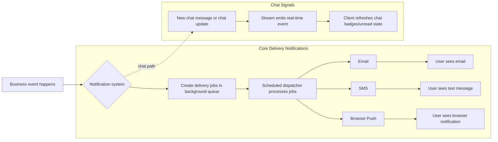

# Notification System Overview (All Channels)

## Who this is for

Product, sales, operations, and engineering teams that need one shared view of customer-facing notifications.

## What this covers

- Core delivery notifications (Email, SMS, Browser Push)
- Chat notification signals in the in-app chat experience
- How business events become user-visible notifications

For the full list of business events, see [notification-event-catalog.md](./notification-event-catalog.md).

## System map

## Channel cheat sheet

| Channel / Type | Typical trigger examples | Where user sees it | Reliability behavior |
| --- | --- | --- | --- |
| Email | Reservation created, verification/claim decisions | Email inbox | Async dispatch with retries |
| SMS | Reservation created, verification/claim decisions | Phone SMS inbox | Async dispatch with retries |
| Browser Push (Web Push) | Reservation and review updates | Browser/OS notification pop-up | Async dispatch with retries; invalid subscriptions are revoked |
| Chat signal | New or updated chat messages | In-app chat badge/inbox state | Real-time chat event updates |

## Key differences

- Core delivery uses outbox jobs and a scheduled dispatcher.
- Core delivery has tracked states (`PENDING`, `SENDING`, `SENT`, `FAILED`, `SKIPPED`).
- Chat signals are real-time Stream events (for example `message.new` and notification variants) and do not run through the outbox dispatcher.
- Delivery guarantees vary by event path: some enqueues are transaction-coupled, while some reservation lifecycle notifications use best-effort enqueue with warning logs.

## Technical appendix

- Core channels: `src/lib/shared/infra/db/schema/enums.ts`
- Core enqueue logic: `src/lib/modules/notification-delivery/services/notification-delivery.service.ts`
- Core dispatch and retries: `src/app/api/cron/dispatch-notification-delivery/route.ts`
- Chat provider integration: `src/lib/modules/chat/providers/stream-chat.provider.ts`
- Chat client handling: `src/features/chat/components/chat-widget/reservation-inbox-widget.tsx`

## When to update this page

Update when any of these change:

- Business notification event list
- Supported channels
- Core queue/dispatch/retry behavior
- Chat event wiring or chat notification behavior
