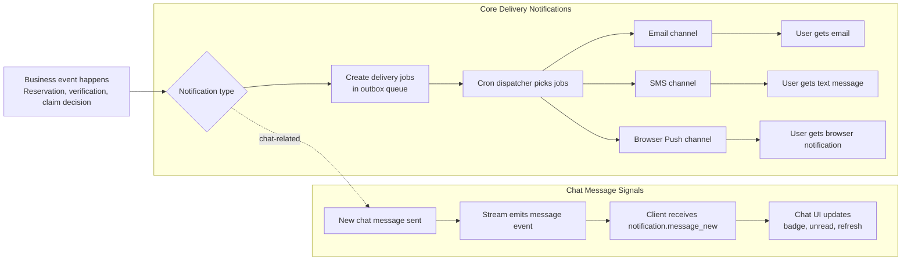

# Notification System Overview (All Channels)

## Who this is for

Product, sales, operations, and engineering teams that need one shared picture of how customer-facing notifications work.

## What this covers

- Core delivery notifications (Email, SMS, Browser Push)
- Chat message notifications in the in-app chat experience
- How events become user-visible notifications

## End-to-end flow (Core + Chat)

> Note: Core delivery and chat are both user-facing notification experiences, but they are different systems. Core delivery uses outbox + cron + retries. Chat uses real-time message events in the chat stack.

## Channel cheat sheet

| Channel / Type | Typical trigger | Where user sees it | Reliability behavior |
| --- | --- | --- | --- |
| Email | Reservation and review updates | Email inbox | Queued and retried on failures |
| SMS | Reservation and review updates | Phone SMS inbox | Queued and retried on failures |
| Browser Push (Web Push) | Reservation and review updates | Browser/OS notification pop-up | Queued and retried; invalid subscriptions are revoked |
| Chat signal | New chat message | In-app chat UI indicators | Real-time event delivery in chat flow |

## Key differences (Core delivery vs Chat signal)

- Core delivery is asynchronous and processed by scheduled dispatch.
- Core delivery tracks job states (`PENDING`, `SENDING`, `SENT`, `FAILED`, `SKIPPED`).
- Chat signal updates the UI through real-time chat events and is not processed by the delivery-job cron pipeline.

## Source-of-truth code references

- Core channel definitions: `src/lib/shared/infra/db/schema/enums.ts`
- Core orchestration and job enqueue: `src/lib/modules/notification-delivery/services/notification-delivery.service.ts`
- Core dispatch and retries: `src/app/api/cron/dispatch-notification-delivery/route.ts`
- Chat provider integration: `src/lib/modules/chat/providers/stream-chat.provider.ts`
- Chat client notification handling: `src/features/chat/components/chat-widget/reservation-inbox-widget.tsx`

## When to update this diagram

Update this page when any of the following changes:

- A new notification channel is added or removed
- Triggering events change meaningfully
- Core delivery flow (queue, cron, retry behavior) changes
- Chat notification behavior or event wiring changes
