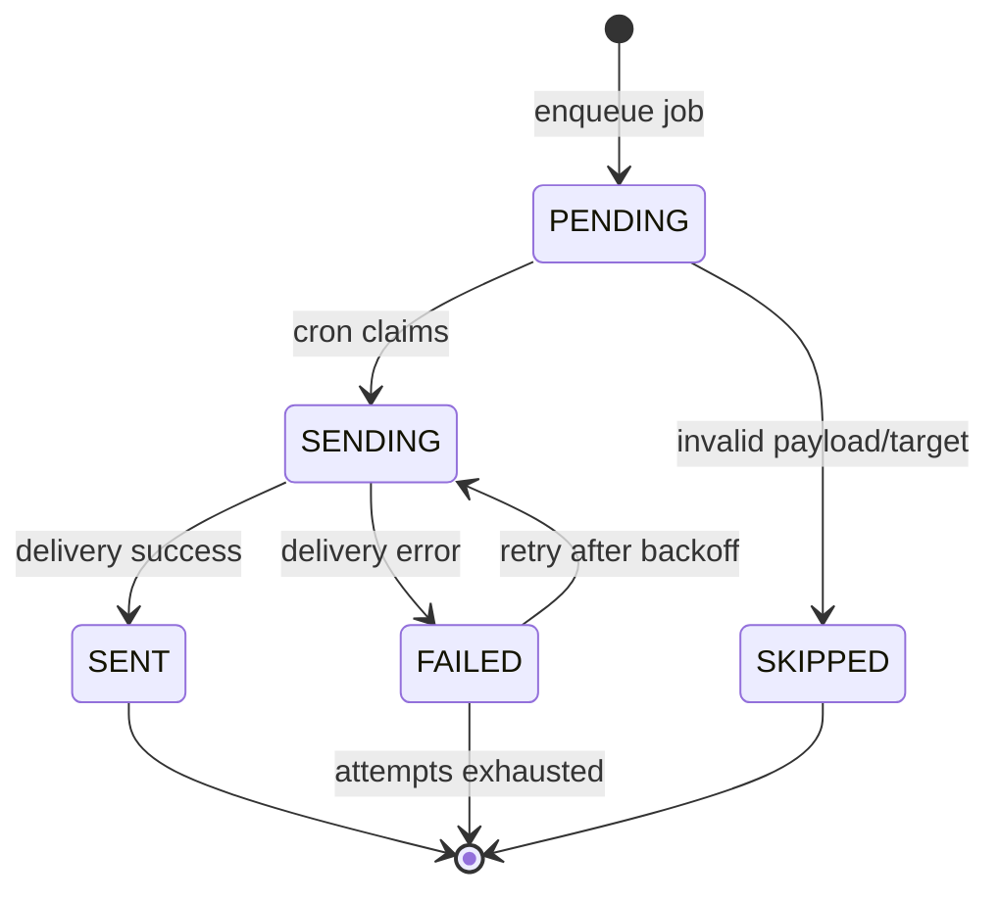

# Notification State Machine - Level 2 Engineering States

This level captures the delivery contract for engineering.

For a non-engineering, cross-channel picture (core delivery + chat signal), see [notification-overview-all-channels.md](./notification-overview-all-channels.md).
For the full business event list, see [notification-event-catalog.md](./notification-event-catalog.md).

## Outbox job state model

Jobs are persisted in `notification_delivery_job` and processed by cron.

States:
- `PENDING`: newly enqueued, ready for dispatch
- `SENDING`: claimed by dispatcher
- `SENT`: delivered successfully
- `FAILED`: last attempt failed (may retry if attempts remain)
- `SKIPPED`: invalid payload/target or unsupported event

## Job state diagram

## Where notification jobs are created (current)

Core delivery events (admins/owners):

1) `place_verification.requested` (notify admins)
- File: `src/lib/modules/place-verification/services/place-verification.service.ts`
- Enqueue inside the same transaction that creates:
  - `place_verification_request`
  - `place_verification_request_event`
  - `place_verification` upsert

2) `reservation.created` (notify court owner)
- Files:
  - `src/lib/modules/reservation/services/reservation.service.ts`
- Enqueue inside the same transaction that creates:
  - `reservation`
  - `reservation_event`

3) `place_verification.approved|rejected` (notify court owner)
- Files:
  - `src/lib/modules/place-verification/services/place-verification-admin.service.ts`
- Enqueue inside the same transaction that updates:
  - `place_verification_request`
  - `place_verification_request_event`
  - `place_verification`
  - `place`

4) `claim_request.approved|rejected` (notify court owner)
- Files:
  - `src/lib/modules/claim-request/use-cases/approve-claim-request.use-case.ts`
  - `src/lib/modules/claim-request/services/claim-admin.service.ts`
- Enqueue inside the same transaction that updates:
  - `claim_request`
  - `claim_request_event`
  - `place`

Reservation lifecycle web push events:

5) `reservation.awaiting_payment` (notify player)
- File: `src/lib/modules/reservation/services/reservation-owner.service.ts`
- Enqueue happens in the reservation-owner transaction path.

6) `reservation.payment_marked` (notify owner)
- File: `src/lib/modules/reservation/services/reservation.service.ts`
- Enqueue is best-effort (warning log on enqueue failure; reservation flow still succeeds).

7) `reservation.confirmed` (notify player)
- File: `src/lib/modules/reservation/services/reservation-owner.service.ts`
- Enqueue happens in reservation-owner transaction paths.

8) `reservation.rejected` (notify player)
- File: `src/lib/modules/reservation/services/reservation-owner.service.ts`
- Enqueue happens in reservation-owner transaction path.

9) `reservation.cancelled` (notify owner)
- File: `src/lib/modules/reservation/services/reservation.service.ts`
- Enqueue is best-effort (warning log on enqueue failure; reservation flow still succeeds).

## Recipients (current)

Admins:
- Resolved via `user_roles.role = "admin"` joined to `profile`.
- Email jobs are created when `profile.email` exists.
- SMS jobs are created when `profile.phoneNumber` exists.

Court owner:
- Resolved via `organization_profile.contactEmail/contactPhone`.
- Fallback to `profile.email/phoneNumber` for `organization.ownerUserId`.

Player:
- Resolved from `reservation.playerId` joined to `profile`.
- Currently used by reservation lifecycle web push events (`awaiting_payment`, `confirmed`, `rejected`).

## Web Push (browser) channel

- Channel enum includes `WEB_PUSH`.
- For `WEB_PUSH` jobs, `notification_delivery_job.target` stores a `push_subscription.id` (one job per device/subscription).
- If a subscription is invalid/expired (HTTP 404/410 from the push service), mark the job `SKIPPED` and revoke the subscription.

## Mobile Push (Expo) channel

- Channel enum includes `MOBILE_PUSH`.
- For `MOBILE_PUSH` jobs, `notification_delivery_job.target` stores a `mobile_push_token.id` (one job per active mobile token).
- The dispatcher sends notifications through Expo Push API (`https://exp.host/--/api/v2/push/send`).
- If Expo returns `DeviceNotRegistered`, the token is revoked and the job is marked `SKIPPED`.

## Idempotency

Each job has a unique `idempotencyKey` to prevent duplicates.

Representative formats:
- `place_verification.requested:<requestId>:admin:<adminUserId>:email`
- `place_verification.requested:<requestId>:admin:<adminUserId>:sms`
- `reservation.created:<reservationId>:org:<organizationId>:email`
- `reservation.created:<reservationId>:org:<organizationId>:sms`
- `place_verification.approved:<requestId>:org:<organizationId>:email`
- `place_verification.approved:<requestId>:org:<organizationId>:sms`
- `place_verification.rejected:<requestId>:org:<organizationId>:email`
- `place_verification.rejected:<requestId>:org:<organizationId>:sms`
- `claim_request.approved:<requestId>:org:<organizationId>:email`
- `claim_request.approved:<requestId>:org:<organizationId>:sms`
- `claim_request.rejected:<requestId>:org:<organizationId>:email`
- `claim_request.rejected:<requestId>:org:<organizationId>:sms`

Web Push adds a per-subscription suffix:
- `reservation.created:<reservationId>:org:<organizationId>:web_push:<pushSubscriptionId>`
- `reservation.awaiting_payment:<reservationId>:user:<userId>:web_push:<pushSubscriptionId>`
- `reservation.payment_marked:<reservationId>:org:<organizationId>:web_push:<pushSubscriptionId>`
- `reservation.confirmed:<reservationId>:user:<userId>:web_push:<pushSubscriptionId>`
- `reservation.rejected:<reservationId>:user:<userId>:web_push:<pushSubscriptionId>`
- `reservation.cancelled:<reservationId>:org:<organizationId>:web_push:<pushSubscriptionId>`

Mobile Push adds a per-token suffix:
- `reservation.created:<reservationId>:org:<organizationId>:mobile_push:<mobilePushTokenId>`
- `reservation.awaiting_payment:<reservationId>:user:<userId>:mobile_push:<mobilePushTokenId>`
- `reservation.payment_marked:<reservationId>:org:<organizationId>:mobile_push:<mobilePushTokenId>`
- `reservation.confirmed:<reservationId>:user:<userId>:mobile_push:<mobilePushTokenId>`
- `reservation.rejected:<reservationId>:user:<userId>:mobile_push:<mobilePushTokenId>`
- `reservation.cancelled:<reservationId>:org:<organizationId>:mobile_push:<mobilePushTokenId>`

## Payload contract

`place_verification.requested` payload:
- `requestId`
- `placeId`
- `placeName`
- `organizationId`
- `organizationName`
- `requestedByUserId`
- `requestNotes` (nullable)

`reservation.created` payload:
- `reservationId`
- `organizationId`
- `placeId`
- `placeName`
- `courtId`
- `courtLabel`
- `startTimeIso`
- `endTimeIso`
- `totalPriceCents`
- `currency`
- `playerName`
- `playerEmail` (nullable)
- `playerPhone` (nullable)
- `expiresAtIso` (nullable)

`place_verification.approved|rejected` payload:
- `requestId`
- `organizationId`
- `placeId`
- `placeName`
- `status` (`APPROVED` | `REJECTED`)
- `reviewNotes` (nullable)

`claim_request.approved|rejected` payload:
- `requestId`
- `organizationId`
- `placeId`
- `placeName`
- `status` (`APPROVED` | `REJECTED`)
- `reviewNotes` (nullable)

Reservation lifecycle web push payloads are also validated in the dispatcher for:
- `reservation.awaiting_payment`
- `reservation.payment_marked`
- `reservation.confirmed`
- `reservation.rejected`
- `reservation.cancelled`

## Dispatcher contract

- Claim criteria:
  - `status IN (PENDING, FAILED)`
  - `attemptCount < MAX_ATTEMPTS`
  - `nextAttemptAt IS NULL OR nextAttemptAt <= now`
- Update to `SENDING` inside a transaction.
- On success: `SENT`, set `sentAt` and `providerMessageId`.
- On failure: `FAILED`, increment `attemptCount`, set `nextAttemptAt`.
