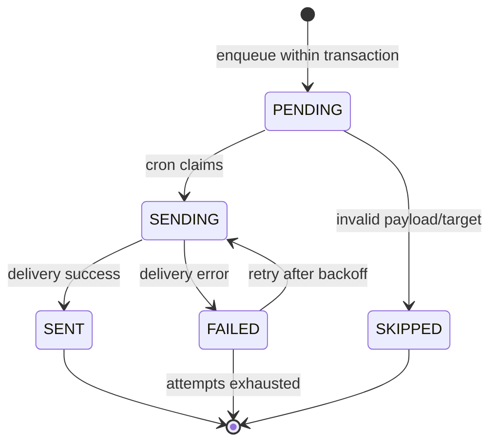

# Notification State Machine - Level 2 Engineering States

This level captures the delivery contract for engineering.

## Outbox job state model

Jobs are persisted in `notification_delivery_job` and processed by cron.

States:
- `PENDING`: newly enqueued, ready for dispatch
- `SENDING`: claimed by dispatcher
- `SENT`: delivered successfully
- `FAILED`: last attempt failed (may retry if attempts remain)
- `SKIPPED`: invalid payload/target or unsupported event

## Job state diagram

## Enqueue chokepoint (MVP)

Event: `place_verification.requested`

- File: `src/lib/modules/place-verification/services/place-verification.service.ts`
- Enqueue inside the same transaction that creates:
  - `place_verification_request`
  - `place_verification_request_event`
  - `place_verification` upsert

## Recipients (MVP)

- Admins are resolved via `user_roles.role = "admin"` joined to `profile`.
- Email jobs are created when `profile.email` exists.
- SMS jobs are created when `profile.phoneNumber` exists.

## Idempotency

Each job has a unique `idempotencyKey` to prevent duplicates.

Format (MVP):
- `place_verification.requested:<requestId>:admin:<adminUserId>:email`
- `place_verification.requested:<requestId>:admin:<adminUserId>:sms`

## Payload contract

`notification_delivery_job.payload` contains:
- `requestId`
- `placeId`
- `placeName`
- `organizationId`
- `organizationName`
- `requestedByUserId`
- `requestNotes` (nullable)

## Dispatcher contract

- Claim criteria:
  - `status IN (PENDING, FAILED)`
  - `attemptCount < MAX_ATTEMPTS`
  - `nextAttemptAt IS NULL OR nextAttemptAt <= now`
- Update to `SENDING` inside a transaction.
- On success: `SENT`, set `sentAt` and `providerMessageId`.
- On failure: `FAILED`, increment `attemptCount`, set `nextAttemptAt`.
