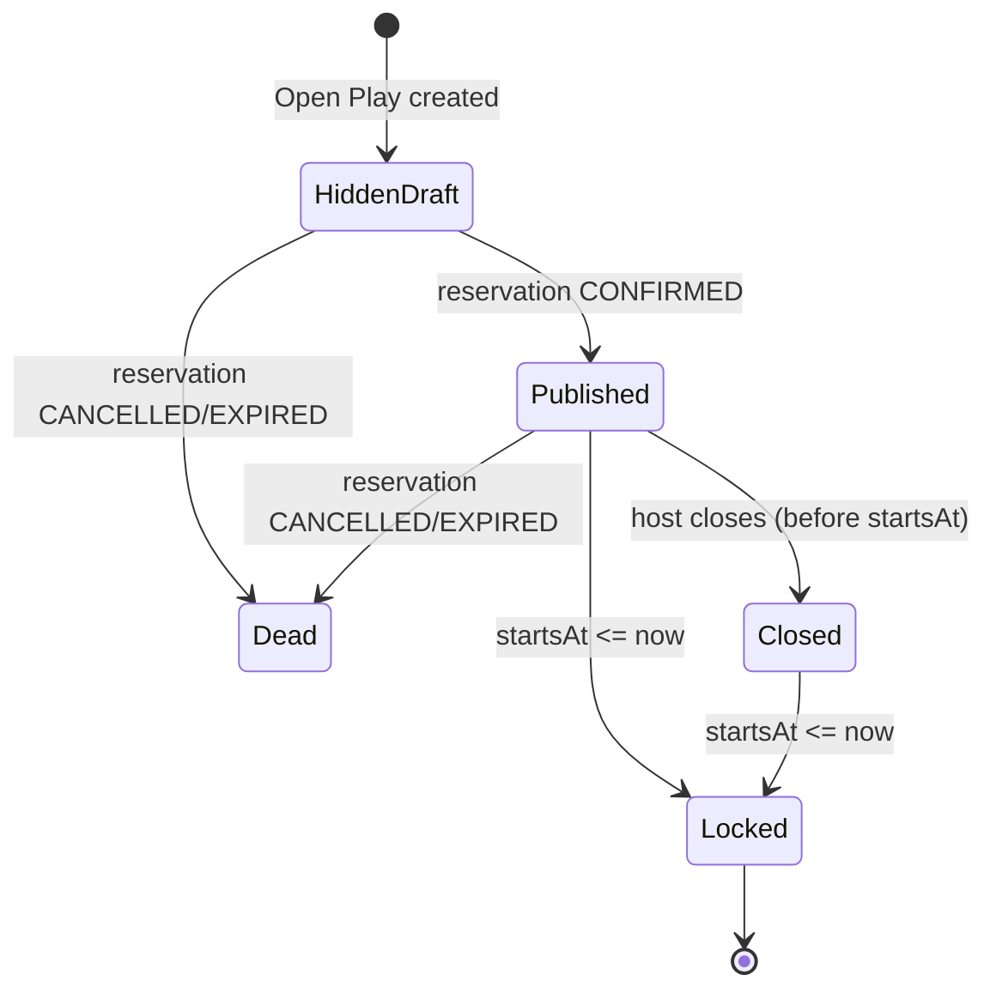
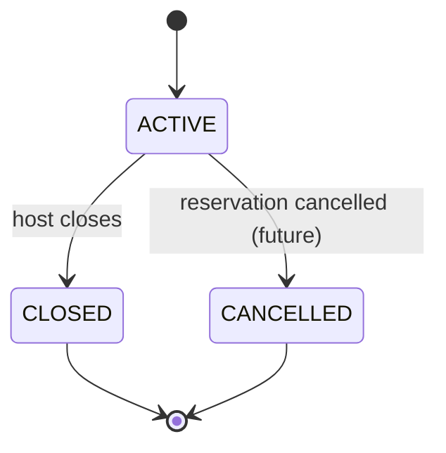
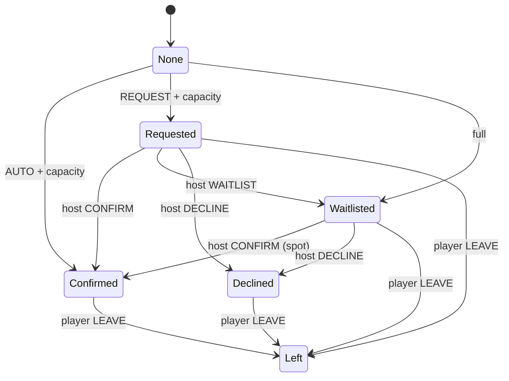
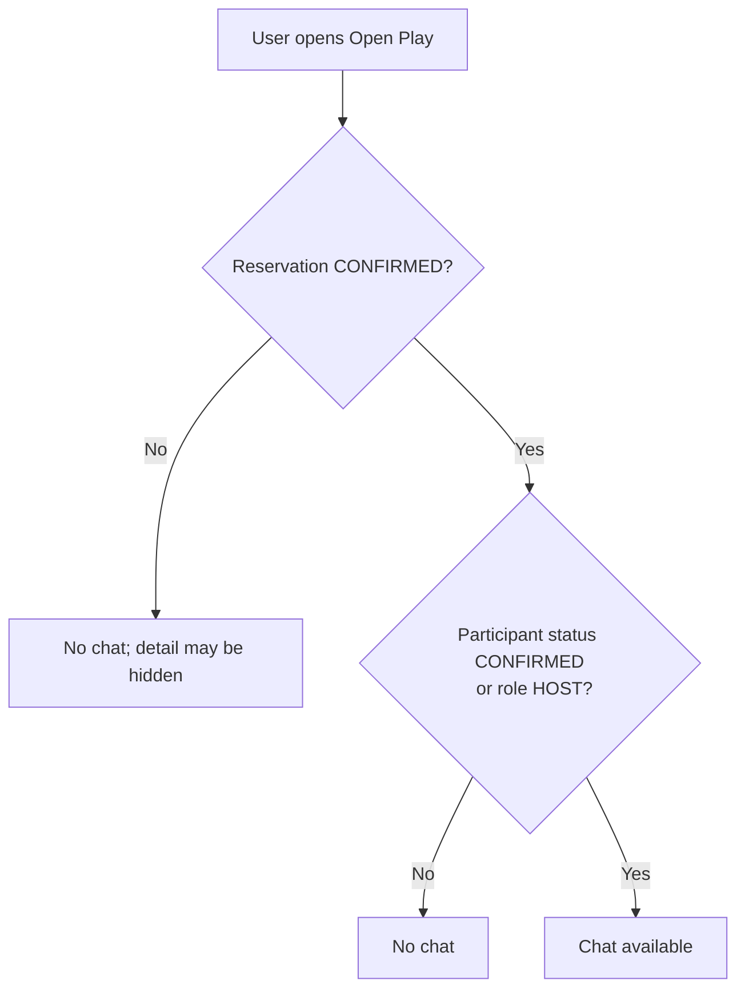

# Open Play State Machines

These diagrams describe observable behavior for users.

## 1) Reservation -> Open Play publish gating

Open Play is attached to a reservation. Publication is derived from reservation confirmation.

Notes:
- HiddenDraft: host can see; others should receive NOT_FOUND.
- Published: can appear in venue list (if `PUBLIC`) and accept joins.
- Locked: joining/moderation locked once the session starts.

## 2) Open Play status

MVP behavior:
- `CANCELLED` is treated as unavailable.

## 3) Participant RSVP lifecycle

## 4) Chat access gating

