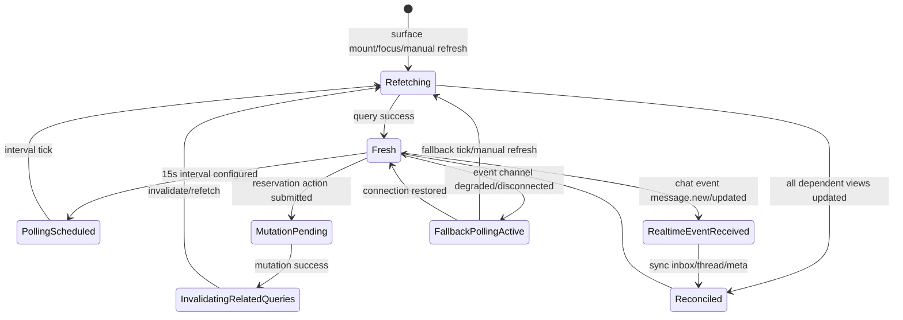

# Polling State Approach

## Purpose
This document defines how reservation state stays synchronized across player, owner, and chat surfaces.

Goals:
- Keep critical reservation UI fresh and consistent.
- Prevent count/list/detail mismatches across screens.
- Keep chat realtime and event-driven.
- Establish a practical path to websocket-based reservation notifications later.

## Current Standard

### Reservation Detail (Player)
- Poll every 15 seconds via query-level polling.
- File: `src/app/(auth)/reservations/[id]/page.tsx`
- Constant: `RESERVATION_DETAIL_REFETCH_INTERVAL_MS = 15_000`
- Query option: `refetchInterval`

### Unresolved Reservations (Owner)
- Poll every 15 seconds across unresolved owner surfaces.
- Shared constants in `src/features/owner/hooks.ts`:
  - `OWNER_UNRESOLVED_REFRESH_INTERVAL_MS = 15_000`
  - `OWNER_UNRESOLVED_REFRESH_INTERVAL_SECONDS = 15`

Applied to:
- Pending count used by dashboard stats (`useOwnerStats`).
- Pending count used by sidebar badge (`useReservationCounts`).
- Reservation alerts polling (`useReservationAlerts`).
- Owner active reservations page list.
- Owner reservations inbox/list page.

### Chat Freshness
- Chat remains realtime via Stream events/subscriptions.
- No fixed chat polling interval is used today.
- Primary files:
  - `src/features/chat/hooks/useStreamChannel.ts`
  - `src/features/chat/components/chat-widget/reservation-inbox-widget.tsx`

## Polling + Sync State Machine

### States
- `Fresh`
- `PollingScheduled`
- `Refetching`
- `MutationPending`
- `InvalidatingRelatedQueries`
- `Reconciled`
- `RealtimeEventReceived`
- `FallbackPollingActive`

### Diagram

### Text Fallback
- On mount/focus/manual refresh, queries refetch and return to `Fresh`.
- During normal operation, polling-enabled surfaces transition `Fresh -> PollingScheduled -> Refetching` every 15s.
- Mutations transition through `MutationPending -> InvalidatingRelatedQueries -> Refetching` to reconcile all dependent surfaces.
- Chat remains event-driven; on degraded event channel, fallback polling keeps state usable.

## Query Sync Matrix

| Surface | Query / Endpoint | Source of truth | Refresh mode | Trigger | Drift risk | Guardrail |
|---|---|---|---|---|---|---|
| Player reservation detail + banner | `reservation.getDetail` | Reservation service detail payload | Poll + manual | `15_000ms`, Refresh button, mutation invalidation | Detail stale vs owner actions | Keep 15s polling + include detail invalidation in reservation mutations |
| Player reservation list + tabs | `reservation.getMyWithDetails` | Reservation list payload | Invalidation-driven | reservation mutations, focus/remount | Counts/list/status lag across sessions | Ensure all player-impacting mutations invalidate list/count queries |
| Owner reservations list/alerts/active | `reservationOwner.getForOrganization` | Owner org reservation feed | Poll + manual | `15_000ms`, manual refresh, owner mutation invalidation | List differs from pending badge if not reconciled | Always pair with pending count invalidation on owner mutations |
| Owner sidebar/dashboard counts | `reservationOwner.getPendingCount` | Pending count endpoint | Poll + invalidation | `15_000ms`, owner mutation invalidation | Badge/count drift vs list | Keep shared interval constant and invalidate with list updates |
| Chat inbox reservation metadata | `reservationChat.getThreadMetas` | Reservation chat metadata service | Event + on-open query + manual | chat open, stream events, manual inbox refresh | Metadata stale after reservation status change | Include thread meta invalidation in reservation status mutations |
| Chat thread session | `reservationChat.getSession` | Reservation chat session endpoint | Event/invalidation-driven | thread open, relevant mutation invalidation | Thread header state stale vs reservation state | Invalidate session on reservation lifecycle mutations |

## Anti-Drift Guardrails
- Treat these as coupled sources for unresolved UX: `reservationOwner.getForOrganization` + `reservationOwner.getPendingCount`.
- Keep polling constants centralized; avoid inline interval literals.
- Keep manual refresh controls where discrepancies are high impact.
- For reservation mutations, define an invalidation contract before merge:
  - player detail/list queries
  - owner list/count queries
  - chat metadata/session queries when state influences chat context
- Prefer query-level polling and targeted invalidation over global default tweaks.

## Migration Plan: Reservation Notifications to Event-Driven (Later)

### Principle
- If users care immediately, prefer push (websocket/event).
- Keep polling fallback for resilience; do not do a big-bang rewrite.

### Phase 0 - Baseline hardening (now)
- Keep current 15s polling for reservation detail + owner unresolved surfaces.
- Keep mutation invalidation contracts explicit and complete.
- Use this doc as canonical sync map.

### Phase 1 - Event contract definition
- Define reservation event envelope (example: `reservation.confirmed`, `reservation.expired`, `reservation.cancelled`).
- Map each event type to affected query keys and UI surfaces.

### Phase 2 - Hybrid mode
- On realtime reservation event, trigger targeted invalidation/refetch for affected queries.
- Preserve existing polling intervals as safety net.

### Phase 3 - Reliability validation
- Measure event delivery/reconnect behavior and stale windows.
- Gradually relax polling frequency behind flags where event reliability is proven.

### Phase 4 - Event-first + fallback
- Use event-driven updates as default for reservation lifecycle UX.
- Keep degraded-mode fallback polling (for disconnects/background/network issues).
- Keep manual refresh as final recovery path.

## Notes on Timers
- A `1000ms` timer used for countdown display is UI-only and not network polling.
- Example: active reservations countdown tick on owner active page.

## Verification Checklist
- `pnpm lint` passes.
- Player reservation detail updates without manual refresh (about every 15s).
- Owner dashboard pending count and sidebar badge update within about 15s.
- Owner active and owner reservations inbox lists update within about 15s.
- Chat remains realtime/event-driven with no new fixed polling loop.
- Mutation flows reconcile list/count/detail within one refresh cycle.

## Reference Paths
- `src/app/(auth)/reservations/[id]/page.tsx`
- `src/features/reservation/hooks.ts`
- `src/features/owner/hooks.ts`
- `src/app/(owner)/owner/page.tsx`
- `src/app/(owner)/owner/reservations/active/page.tsx`
- `src/app/(owner)/owner/reservations/page.tsx`
- `src/features/chat/hooks/useStreamChannel.ts`
- `src/features/chat/components/chat-widget/reservation-inbox-widget.tsx`
