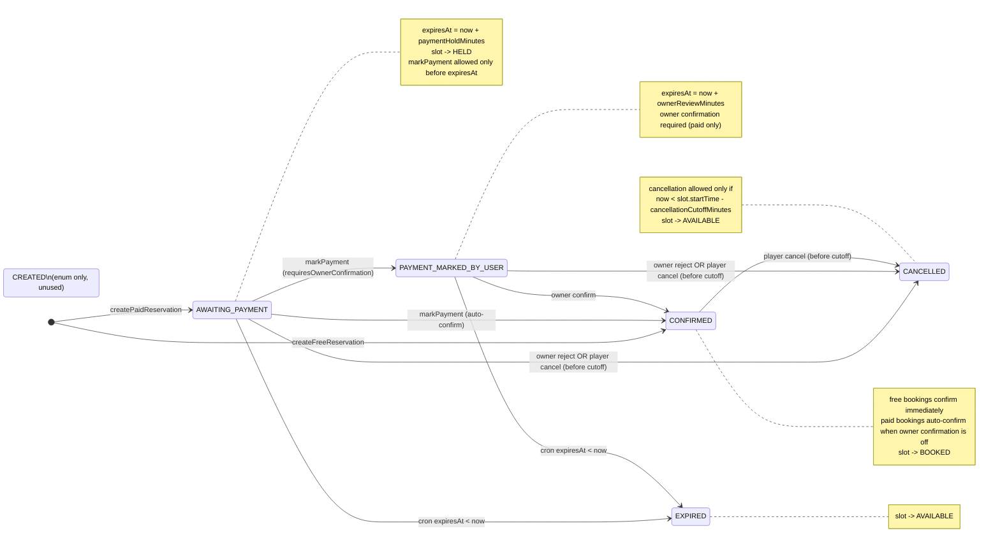
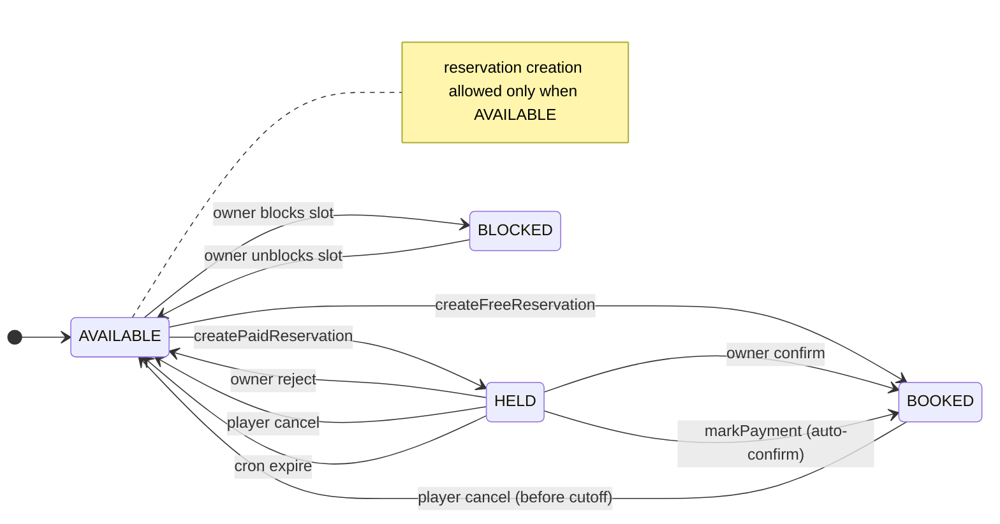

```mermaid
stateDiagram-v2
  direction LR
  state "CREATED\n(enum only, unused)" as CREATED

  [*] --> CONFIRMED: createFreeReservation
  [*] --> AWAITING_PAYMENT: createPaidReservation

  AWAITING_PAYMENT --> PAYMENT_MARKED_BY_USER: markPayment (requiresOwnerConfirmation)
  AWAITING_PAYMENT --> CONFIRMED: markPayment (auto-confirm)
  PAYMENT_MARKED_BY_USER --> CONFIRMED: owner confirm

  AWAITING_PAYMENT --> CANCELLED: owner reject OR player cancel (before cutoff)
  PAYMENT_MARKED_BY_USER --> CANCELLED: owner reject OR player cancel (before cutoff)
  CONFIRMED --> CANCELLED: player cancel (before cutoff)

  AWAITING_PAYMENT --> EXPIRED: cron expiresAt < now
  PAYMENT_MARKED_BY_USER --> EXPIRED: cron expiresAt < now

  note right of AWAITING_PAYMENT
    expiresAt = now + paymentHoldMinutes
    slot -> HELD
    markPayment allowed only before expiresAt
  end note

  note right of PAYMENT_MARKED_BY_USER
    expiresAt = now + ownerReviewMinutes
    owner confirmation required (paid only)
  end note

  note right of CONFIRMED
    free bookings confirm immediately
    paid bookings auto-confirm when owner confirmation is off
    slot -> BOOKED
  end note

  note left of CANCELLED
    cancellation allowed only if
    now < slot.startTime - cancellationCutoffMinutes
    slot -> AVAILABLE
  end note

  note right of EXPIRED
    slot -> AVAILABLE
  end note
```

```mermaid
stateDiagram-v2
  direction LR
  [*] --> AVAILABLE

  AVAILABLE --> HELD: createPaidReservation
  AVAILABLE --> BOOKED: createFreeReservation

  HELD --> BOOKED: owner confirm
  HELD --> BOOKED: markPayment (auto-confirm)
  HELD --> AVAILABLE: owner reject
  HELD --> AVAILABLE: player cancel
  HELD --> AVAILABLE: cron expire

  BOOKED --> AVAILABLE: player cancel (before cutoff)

  AVAILABLE --> BLOCKED: owner blocks slot
  BLOCKED --> AVAILABLE: owner unblocks slot

  note right of AVAILABLE
    reservation creation allowed only when AVAILABLE
  end note
```
