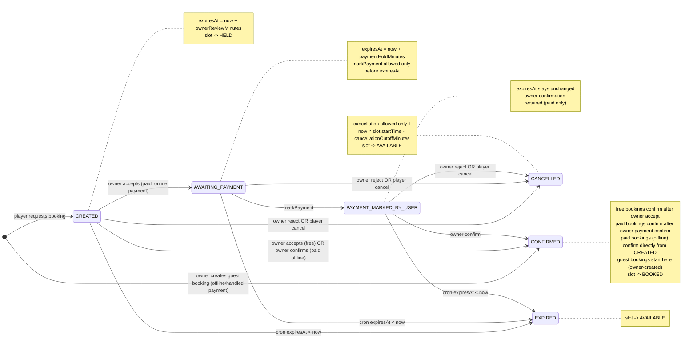
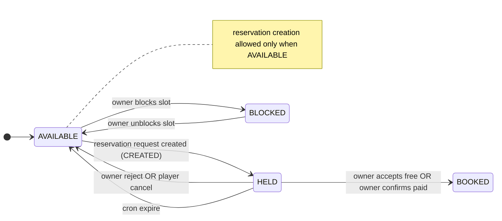

```mermaid
stateDiagram-v2
  direction LR
  [*] --> CREATED: player requests booking
  [*] --> CONFIRMED: owner creates guest booking (offline/handled payment)

  CREATED --> CONFIRMED: owner accepts (free) OR owner confirms (paid offline)
  CREATED --> AWAITING_PAYMENT: owner accepts (paid, online payment)
  CREATED --> CANCELLED: owner reject OR player cancel
  CREATED --> EXPIRED: cron expiresAt < now

  AWAITING_PAYMENT --> PAYMENT_MARKED_BY_USER: markPayment
  AWAITING_PAYMENT --> CANCELLED: owner reject OR player cancel
  AWAITING_PAYMENT --> EXPIRED: cron expiresAt < now

  PAYMENT_MARKED_BY_USER --> CONFIRMED: owner confirm
  PAYMENT_MARKED_BY_USER --> CANCELLED: owner reject OR player cancel
  PAYMENT_MARKED_BY_USER --> EXPIRED: cron expiresAt < now

  note right of CREATED
    expiresAt = now + ownerReviewMinutes
    slot -> HELD
  end note

  note right of AWAITING_PAYMENT
    expiresAt = now + paymentHoldMinutes
    markPayment allowed only before expiresAt
  end note

  note right of PAYMENT_MARKED_BY_USER
    expiresAt stays unchanged
    owner confirmation required (paid only)
  end note

  note right of CONFIRMED
    free bookings confirm after owner accept
    paid bookings confirm after owner payment confirm
    paid bookings (offline) confirm directly from CREATED
    guest bookings start here (owner-created)
    slot -> BOOKED
  end note

  note left of CANCELLED
    cancellation allowed only if
    now < slot.startTime - cancellationCutoffMinutes
    slot -> AVAILABLE
  end note

  note right of EXPIRED
    slot -> AVAILABLE
  end note
```

```mermaid
stateDiagram-v2
  direction LR
  [*] --> AVAILABLE

  AVAILABLE --> HELD: reservation request created (CREATED)

  HELD --> BOOKED: owner accepts free OR owner confirms paid
  HELD --> AVAILABLE: owner reject OR player cancel
  HELD --> AVAILABLE: cron expire

  AVAILABLE --> BLOCKED: owner blocks slot
  BLOCKED --> AVAILABLE: owner unblocks slot

  note right of AVAILABLE
    reservation creation allowed only when AVAILABLE
  end note
```
