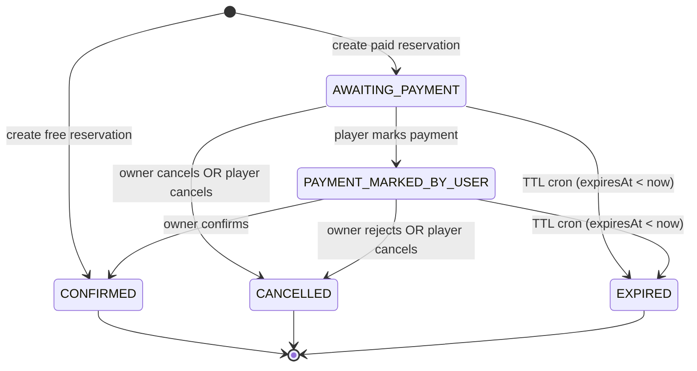
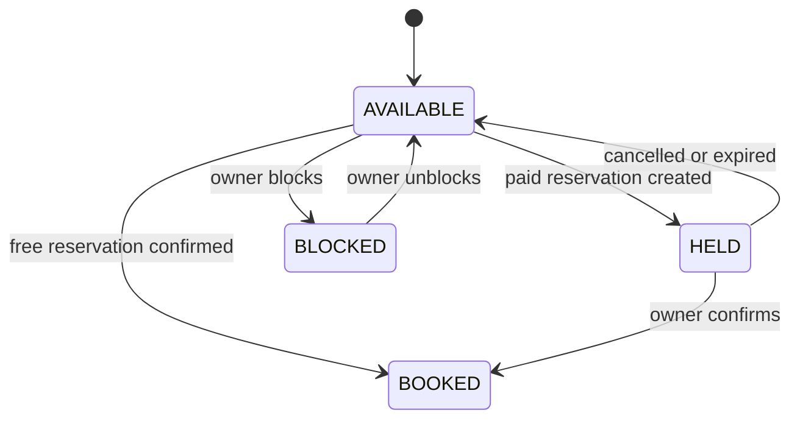

# Reservation State Machine — Level 2 Engineering States

## Reservation statuses
- `AWAITING_PAYMENT`: paid reservation created; `expiresAt` is set.
- `PAYMENT_MARKED_BY_USER`: player marked payment; owner must confirm.
- `CONFIRMED`: free booking or owner-confirmed paid booking.
- `CANCELLED`: player cancelled or owner rejected before confirmation.
- `EXPIRED`: TTL expired via cron.
- `CREATED`: enum value defined but not used in current flow.

## Key transitions
- `AWAITING_PAYMENT` → `PAYMENT_MARKED_BY_USER` (player marks payment).
- `AWAITING_PAYMENT` → `CANCELLED` (player cancels, or owner cancels via owner ops).
- `AWAITING_PAYMENT` → `EXPIRED` (TTL cron).
- `PAYMENT_MARKED_BY_USER` → `CONFIRMED` (owner confirms).
- `PAYMENT_MARKED_BY_USER` → `CANCELLED` (player cancels, or owner rejects).
- `PAYMENT_MARKED_BY_USER` → `EXPIRED` (TTL cron).

## Owner ops (status → allowed actions)
- `AWAITING_PAYMENT`
  - Owner UI: label "Awaiting payment" with TTL countdown.
  - Actions: view details, cancel (implemented via `reservationOwner.reject` → `CANCELLED`).
- `PAYMENT_MARKED_BY_USER`
  - Owner UI: label "Payment marked".
  - Actions: view details, confirm (`reservationOwner.confirmPayment`), reject (`reservationOwner.reject` → `CANCELLED`).

## Owner slot list enrichment
- Owner slot list joins reservation fields into slots:
  - `reservationId`, `reservationStatus`, `reservationExpiresAt`.
- Slot status is still derived from time slot status (`AVAILABLE`/`HELD`/`BOOKED`/`BLOCKED`), but the UI label for `HELD` is driven by `reservationStatus`:
  - `AWAITING_PAYMENT` → "Awaiting payment"
  - `PAYMENT_MARKED_BY_USER` → "Payment marked"

## Reservation state diagram

## Time slot state diagram

## TTL rules
- Paid reservations set `expiresAt = now + 15 minutes` and start at `AWAITING_PAYMENT`.
- TTL window is fixed from creation; marking payment does not extend `expiresAt`.
- Marking payment is allowed only for `AWAITING_PAYMENT` and only before `expiresAt`.
- Owner confirmation transitions `PAYMENT_MARKED_BY_USER` → `CONFIRMED`.
- Owner rejection/cancellation uses `reservationOwner.reject` and is allowed for `AWAITING_PAYMENT` or `PAYMENT_MARKED_BY_USER`.
- Player cancellation is allowed before `CONFIRMED` and moves to `CANCELLED`.
- Cron expiration applies to both `AWAITING_PAYMENT` and `PAYMENT_MARKED_BY_USER`.

## Time slot coupling
- `AVAILABLE` → `HELD` when paid reservation created.
- `HELD` → `BOOKED` on owner confirmation.
- `HELD` → `AVAILABLE` on expiration or cancellation.
- `AVAILABLE` → `BOOKED` when free reservation confirmed.
- `AVAILABLE` ↔ `BLOCKED` when owner blocks/unblocks slots.
- `BOOKED` has no automated release in current flow.
