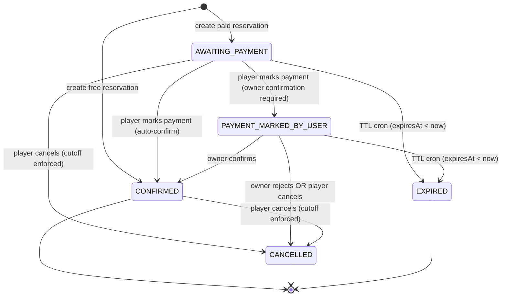
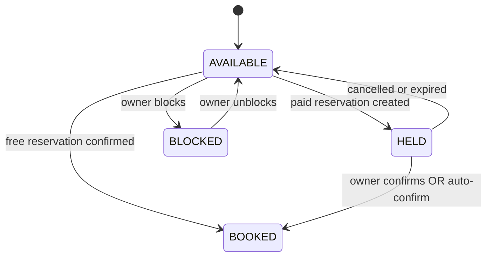

# Reservation State Machine — Level 2 Engineering States

## Reservation statuses
- `AWAITING_PAYMENT`: paid reservation created; `expiresAt` is set from `paymentHoldMinutes`.
- `PAYMENT_MARKED_BY_USER`: player marked payment; owner must confirm **when required**.
- `CONFIRMED`: free booking or paid booking confirmed (owner or auto-confirm).
- `CANCELLED`: player cancelled (cutoff enforced) or owner rejected.
- `EXPIRED`: TTL expired via cron.
- `CREATED`: enum value defined but not used in current flow.

## Key transitions
- `AWAITING_PAYMENT` → `PAYMENT_MARKED_BY_USER` (player marks payment; only when owner confirmation is required).
- `AWAITING_PAYMENT` → `CONFIRMED` (player marks payment; auto-confirm when owner confirmation is disabled).
- `AWAITING_PAYMENT` → `CANCELLED` (player cancels; cutoff enforced).
- `AWAITING_PAYMENT` → `EXPIRED` (TTL cron).
- `PAYMENT_MARKED_BY_USER` → `CONFIRMED` (owner confirms).
- `PAYMENT_MARKED_BY_USER` → `CANCELLED` (player cancels; cutoff enforced, or owner rejects).
- `PAYMENT_MARKED_BY_USER` → `EXPIRED` (TTL cron).
- `CONFIRMED` → `CANCELLED` (player cancels; cutoff enforced).

## Owner ops (status → allowed actions)
- `AWAITING_PAYMENT`
  - Owner UI: label "Awaiting payment" with TTL countdown.
  - Actions: view details, cancel (via `reservationOwner.reject`).
- `PAYMENT_MARKED_BY_USER` (only when owner confirmation required)
  - Owner UI: label "Payment marked".
  - Actions: confirm (`reservationOwner.confirmPayment`), reject (`reservationOwner.reject`).

## Owner slot list enrichment
- Owner slot list joins reservation fields into slots:
  - `reservationId`, `reservationStatus`, `reservationExpiresAt`.
- Slot status is still derived from time slot status (`AVAILABLE`/`HELD`/`BOOKED`/`BLOCKED`), but the UI label for `HELD` is driven by `reservationStatus`:
  - `AWAITING_PAYMENT` → "Awaiting payment"
  - `PAYMENT_MARKED_BY_USER` → "Payment marked"

## Reservation state diagram

## Time slot state diagram

## TTL rules
- Paid reservations set `expiresAt = now + paymentHoldMinutes` per court.
- When a player marks payment:
  - If owner confirmation is required: `expiresAt = now + ownerReviewMinutes`.
  - If owner confirmation is disabled: reservation auto-confirms and `expiresAt` is cleared.
- Player cannot mark payment after `expiresAt`.
- Cron expiration applies to both `AWAITING_PAYMENT` and `PAYMENT_MARKED_BY_USER` based on `expiresAt`.
- Cancellation is allowed across all non-terminal statuses, but blocked after the cancellation cutoff window.

## Time slot coupling
- `AVAILABLE` → `HELD` when paid reservation created.
- `HELD` → `BOOKED` on owner confirmation or auto-confirm.
- `HELD` → `AVAILABLE` on expiration or cancellation.
- `AVAILABLE` → `BOOKED` when free reservation confirmed.
- `AVAILABLE` ↔ `BLOCKED` when owner blocks/unblocks slots.
- `BOOKED` has no automated release in current flow.
