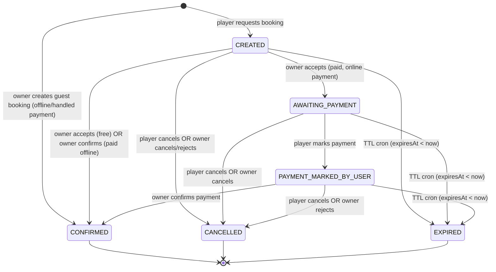

# Reservation State Machine — Level 2 Engineering States

This level captures the state machine as a contract for engineering. It reflects the desired behavior for the mutual-confirmation flow.

## Availability Model

Availability is **computed on-the-fly**, not stored:
- Schedule rules (`court_hours_window` + `court_rate_rule`) define when a court is bookable.
- Existing reservations (non-terminal statuses) subtract from available time ranges.
- `court_block` entries subtract from available time ranges (owner-defined exceptions).
- Reservations store `courtId + startTime + endTime` directly (no slot FK).

## Identity invariant

Every reservation has **exactly one** of:
- `playerId` — registered player (player-created bookings).
- `guestProfileId` — ad-hoc guest profile (owner-created guest bookings).

These columns are mutually exclusive; a CHECK constraint enforces that exactly one is non-null.

## Reservation statuses
- `CREATED`
  - Meaning: booking request created by player (player bookings only; guest bookings skip this).
  - Availability effect: time range excluded from availability (pending reservation).
  - TTL: `expiresAt` is set to `now + 45 minutes` (owner acceptance window).
- `AWAITING_PAYMENT`
  - Meaning: owner accepted a paid request; waiting for player payment.
  - TTL: `expiresAt` is reset to `now + 45 minutes` (fresh payment window).
- `PAYMENT_MARKED_BY_USER`
  - Meaning: player marked payment complete; waiting for owner confirmation.
  - TTL: uses the same `expiresAt` window (does not extend).
- `CONFIRMED`
  - Meaning: final state.
  - Free: owner acceptance transitions directly to `CONFIRMED`.
  - Paid: owner confirmation transitions to `CONFIRMED`.
  - Paid (offline): owner confirms directly from `CREATED`, bypassing payment flow.
  - Guest booking: created directly as `CONFIRMED` by owner (`[*] → CONFIRMED`).
- `CANCELLED`
  - Meaning: request/reservation was cancelled by player or cancelled/rejected by owner.
  - Availability effect: time range becomes available again (computed).
- `EXPIRED`
  - Meaning: TTL expired and system released the reservation.
  - Availability effect: time range becomes available again (computed).

## Key transitions
- `[*]` → `CONFIRMED` (owner creates guest booking — offline/handled payment).
- `CREATED` → `AWAITING_PAYMENT` (owner accepts a paid request).
- `CREATED` → `CONFIRMED` (owner accepts a free request, OR owner confirms paid request with offline payment).
- `CREATED` → `CANCELLED` (player cancels or owner cancels/rejects).
- `CREATED` → `EXPIRED` (TTL cron).

- `AWAITING_PAYMENT` → `PAYMENT_MARKED_BY_USER` (player marks payment).
- `AWAITING_PAYMENT` → `CANCELLED` (player cancels or owner cancels).
- `AWAITING_PAYMENT` → `EXPIRED` (TTL cron).

- `PAYMENT_MARKED_BY_USER` → `CONFIRMED` (owner confirms payment).
- `PAYMENT_MARKED_BY_USER` → `CANCELLED` (player cancels or owner rejects).
- `PAYMENT_MARKED_BY_USER` → `EXPIRED` (TTL cron).

## Reservation state diagram


## Availability computation (replaces time slot state machine)

There is no `time_slot` table. Availability is computed:

```
available_times = schedule_rules(court, date)
                  - active_reservations(court, date)
                  - court_blocks(court, date)
```

Where:
- `schedule_rules`: generated from `court_hours_window` + `court_rate_rule`
- `active_reservations`: reservations with status NOT IN (CANCELLED, EXPIRED)
- `court_blocks`: explicit owner-defined blocked time ranges

### Blocking behavior
- Owners block time ranges via `court_block` table (not slot status).
- Blocked ranges are excluded from availability computation.

## TTL rules
- **Owner acceptance window**
  - On `CREATED`, set `expiresAt = now + 45 minutes`.
  - If not accepted in time: expire and release.
- **Payment window**
  - When owner accepts a paid request: set `expiresAt = now + 45 minutes` (fresh).
  - Marking payment does not extend the deadline.
- **Expiration scope**
  - Cron expiration applies to `CREATED`, `AWAITING_PAYMENT`, and `PAYMENT_MARKED_BY_USER` when `expiresAt < now`.

## Owner ops (status → allowed actions)
- `CREATED`
  - Owner sees request immediately.
  - Actions: accept, cancel/reject, view.
- `AWAITING_PAYMENT`
  - Actions: cancel, view.
- `PAYMENT_MARKED_BY_USER`
  - Actions: confirm, reject, view.

## References
- `agent-contexts/00-13-owner-reservation-ops.md`
- `src/shared/infra/db/schema/enums.ts`
- `src/shared/infra/db/schema/reservation.ts`
- `src/shared/infra/db/schema/court-block.ts`
- `src/modules/availability/services/availability.service.ts`
