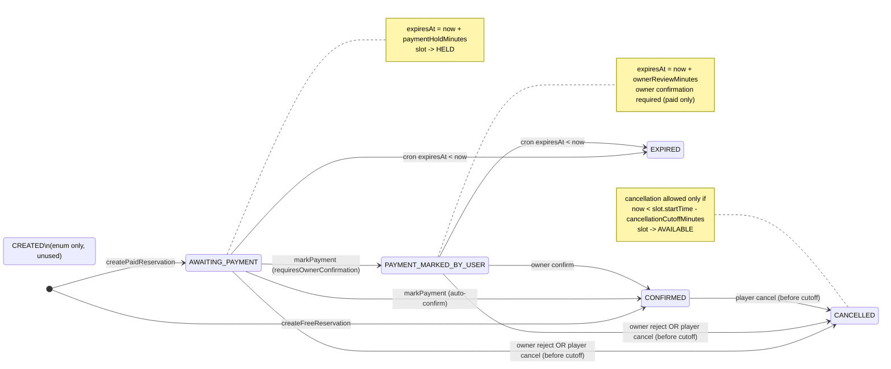
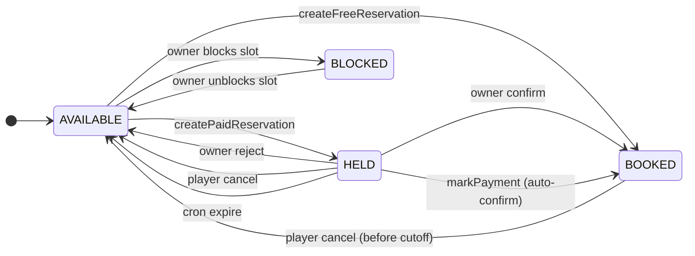

# Reservation State Machine — Level 2 Engineering States

## Reservation statuses
- `AWAITING_PAYMENT`: paid reservation created; `expiresAt` set from `paymentHoldMinutes`.
- `PAYMENT_MARKED_BY_USER`: player marked payment and owner confirmation is required; `expiresAt` set from `ownerReviewMinutes`.
- `CONFIRMED`: free booking or paid booking confirmed (owner or auto-confirm).
- `CANCELLED`: player cancelled (cutoff enforced) or owner rejected/cancelled.
- `EXPIRED`: TTL expired via cron.
- `CREATED`: enum value defined but not used in current flow.

## Court policy inputs (reservable court detail)
- `requiresOwnerConfirmation` (boolean, paid bookings only)
- `paymentHoldMinutes` (TTL for `AWAITING_PAYMENT`)
- `ownerReviewMinutes` (TTL for `PAYMENT_MARKED_BY_USER`)
- `cancellationCutoffMinutes` (minutes before slot start when cancellation is blocked)

## Key transitions (by code path)

| Transition | Trigger | Function | Data updates |
|-----------|---------|----------|--------------|
| `[*] → CONFIRMED` | Create free reservation | `CreateFreeReservationUseCase.execute` | `reservation.status=CONFIRMED`, `confirmedAt=now`, `time_slot.status=BOOKED`, `reservation_event` created |
| `[*] → AWAITING_PAYMENT` | Create paid reservation | `CreatePaidReservationUseCase.execute` | `reservation.status=AWAITING_PAYMENT`, `expiresAt=now+paymentHoldMinutes`, `time_slot.status=HELD`, `reservation_event` created |
| `AWAITING_PAYMENT → PAYMENT_MARKED_BY_USER` | Player marks payment (owner confirmation required) | `ReservationService.markPayment` | `reservation.status=PAYMENT_MARKED_BY_USER`, `termsAcceptedAt=now`, `expiresAt=now+ownerReviewMinutes`, `reservation_event` created |
| `AWAITING_PAYMENT → CONFIRMED` | Player marks payment (auto-confirm) | `ReservationService.markPayment` | `reservation.status=CONFIRMED`, `confirmedAt=now`, `expiresAt=null`, `time_slot.status=BOOKED`, `reservation_event` created |
| `PAYMENT_MARKED_BY_USER → CONFIRMED` | Owner confirms | `ReservationOwnerService.confirmPayment` | `reservation.status=CONFIRMED`, `confirmedAt=now`, `time_slot.status=BOOKED`, `reservation_event` created |
| `AWAITING_PAYMENT → CANCELLED` | Owner rejects | `ReservationOwnerService.rejectReservation` | `reservation.status=CANCELLED`, `cancelledAt=now`, `time_slot.status=AVAILABLE`, `reservation_event` created |
| `PAYMENT_MARKED_BY_USER → CANCELLED` | Owner rejects | `ReservationOwnerService.rejectReservation` | `reservation.status=CANCELLED`, `cancelledAt=now`, `time_slot.status=AVAILABLE`, `reservation_event` created |
| `AWAITING_PAYMENT/PAYMENT_MARKED_BY_USER/CONFIRMED → CANCELLED` | Player cancels (cutoff enforced) | `ReservationService.cancelReservation` | `reservation.status=CANCELLED`, `cancelledAt=now`, `time_slot.status=AVAILABLE`, `reservation_event` created |
| `AWAITING_PAYMENT/PAYMENT_MARKED_BY_USER → EXPIRED` | Cron (expiresAt < now) | `GET /api/cron/expire-reservations` | `reservation.status=EXPIRED`, `time_slot.status=AVAILABLE`, `reservation_event` created |

## Transition rules (guards)
- Reservation creation only allowed when `time_slot.status=AVAILABLE`.
- Paid vs free detection: `ReservationService.createReservation` checks `reservable_court_detail.is_free` and slot/default price.
- `markPayment` only allowed from `AWAITING_PAYMENT` and only before `expiresAt`.
- Owner confirmation (`PAYMENT_MARKED_BY_USER`) is only used for **paid reservations** when `requiresOwnerConfirmation=true`.
- Cancellation is allowed for all non-terminal statuses, but blocked if `now > slot.startTime - cancellationCutoffMinutes`.
- Owner reject is allowed for `AWAITING_PAYMENT` and `PAYMENT_MARKED_BY_USER` only.

## Database fields involved

### `reservation`
- `status`, `expiresAt`, `confirmedAt`, `cancelledAt`, `cancellationReason`, `termsAcceptedAt`, `timeSlotId`, `playerId`.

### `time_slot`
- `status` (`AVAILABLE`, `HELD`, `BOOKED`, `BLOCKED`).

### `reservable_court_detail`
- `requiresOwnerConfirmation`, `paymentHoldMinutes`, `ownerReviewMinutes`, `cancellationCutoffMinutes`.

### `reservation_event`
- Audit log per transition with `fromStatus`, `toStatus`, and `triggeredByRole` (`PLAYER`, `OWNER`, `SYSTEM`).

## Reservation state diagram

## Time slot state diagram

## Implementation references
- `src/modules/reservation/use-cases/create-free-reservation.use-case.ts`
- `src/modules/reservation/use-cases/create-paid-reservation.use-case.ts`
- `src/modules/reservation/services/reservation.service.ts`
- `src/modules/reservation/services/reservation-owner.service.ts`
- `src/app/api/cron/expire-reservations/route.ts`
- `src/shared/infra/db/schema/enums.ts`
