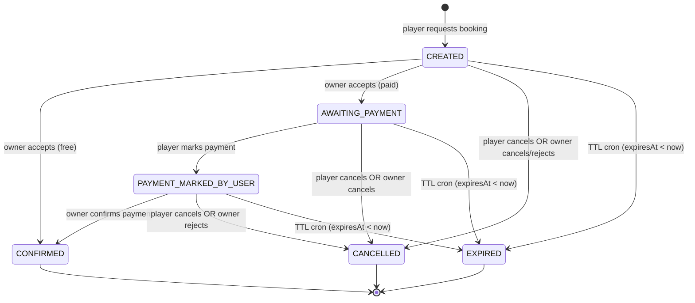
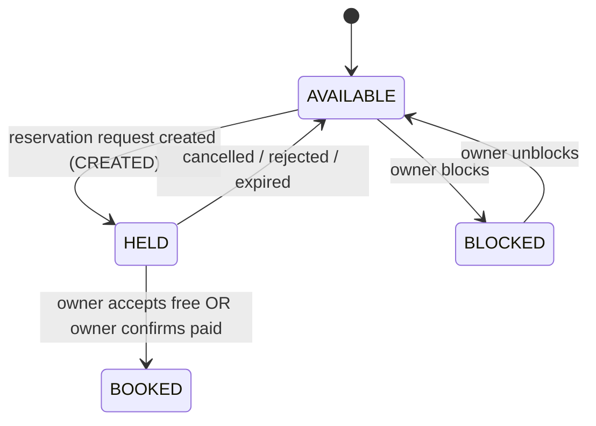

# Reservation State Machine — Level 2 Engineering States

This level captures the state machine as a contract for engineering. It reflects the desired behavior for the mutual-confirmation flow.

## Reservation statuses
- `CREATED`
  - Meaning: booking request created by player.
  - Slot effect: slot is held immediately (`AVAILABLE` → `HELD`).
  - TTL: `expiresAt` is set to `now + 15 minutes` (owner acceptance window).
- `AWAITING_PAYMENT`
  - Meaning: owner accepted a paid request; waiting for player payment.
  - TTL: `expiresAt` is reset to `now + 15 minutes` (fresh payment window).
- `PAYMENT_MARKED_BY_USER`
  - Meaning: player marked payment complete; waiting for owner confirmation.
  - TTL: uses the same `expiresAt` window (does not extend).
- `CONFIRMED`
  - Meaning: final state.
  - Free: owner acceptance transitions directly to `CONFIRMED`.
  - Paid: owner confirmation transitions to `CONFIRMED`.
- `CANCELLED`
  - Meaning: request/reservation was cancelled by player or cancelled/rejected by owner.
- `EXPIRED`
  - Meaning: TTL expired and system released the hold.

## Key transitions
- `CREATED` → `AWAITING_PAYMENT` (owner accepts a paid request).
- `CREATED` → `CONFIRMED` (owner accepts a free request).
- `CREATED` → `CANCELLED` (player cancels or owner cancels/rejects).
- `CREATED` → `EXPIRED` (TTL cron).

- `AWAITING_PAYMENT` → `PAYMENT_MARKED_BY_USER` (player marks payment).
- `AWAITING_PAYMENT` → `CANCELLED` (player cancels or owner cancels).
- `AWAITING_PAYMENT` → `EXPIRED` (TTL cron).

- `PAYMENT_MARKED_BY_USER` → `CONFIRMED` (owner confirms payment).
- `PAYMENT_MARKED_BY_USER` → `CANCELLED` (player cancels or owner rejects).
- `PAYMENT_MARKED_BY_USER` → `EXPIRED` (TTL cron).

## Reservation state diagram

## Time slot state diagram

## TTL rules
- **Owner acceptance window**
  - On `CREATED`, set `expiresAt = now + 15 minutes`.
  - If not accepted in time: expire and release.
- **Payment window**
  - When owner accepts a paid request: set `expiresAt = now + 15 minutes` (fresh).
  - Marking payment does not extend the deadline.
- **Expiration scope**
  - Cron expiration applies to `CREATED`, `AWAITING_PAYMENT`, and `PAYMENT_MARKED_BY_USER` when `expiresAt < now`.

## Owner ops (status → allowed actions)
- `CREATED`
  - Owner sees request immediately.
  - Actions: accept, cancel/reject, view.
- `AWAITING_PAYMENT`
  - Actions: cancel, view.
- `PAYMENT_MARKED_BY_USER`
  - Actions: confirm, reject, view.

## References
- `agent-contexts/00-13-owner-reservation-ops.md`
- `src/shared/infra/db/schema/enums.ts`
- `src/shared/infra/db/schema/reservation.ts`
