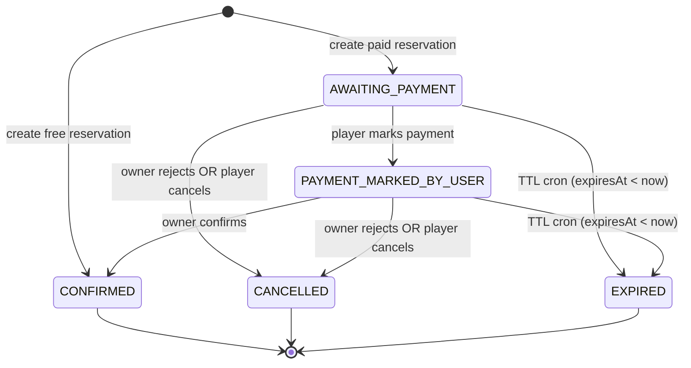

# Reservation State Machine (TTL)

## Overview
- Paid reservations use a 15-minute TTL window.
- Free reservations are confirmed immediately.
- Slot state transitions are coupled to reservation status.

## Current Diagram (from agent-contexts)
```
┌─────────────────────────────────────────────────────────────┐
│                    FREE COURT BOOKING                        │
├─────────────────────────────────────────────────────────────┤
│  Player → Select Free Slot → Reserve                         │
│     ↓                                                        │
│  Reservation: CONFIRMED                                      │
│  Slot: AVAILABLE → BOOKED                                    │
│  ✅ Done (immediate confirmation)                            │
└─────────────────────────────────────────────────────────────┘

┌─────────────────────────────────────────────────────────────┐
│                    PAID COURT BOOKING                        │
├─────────────────────────────────────────────────────────────┤
│  Player → Select Paid Slot → Reserve                         │
│     ↓                                                        │
│  Reservation: AWAITING_PAYMENT (expiresAt = NOW() + 15min)  │
│  Slot: AVAILABLE → HELD                                      │
│     ↓                                                        │
│  [15-Min Window]                                             │
│     ↓                                                        │
│  Player → /reservations/[id]/payment                         │
│     → Enter reference/notes                                  │
│     → Accept T&C                                             │
│     → "I Have Paid"                                          │
│     ↓                                                        │
│  Reservation: PAYMENT_MARKED_BY_USER                         │
│  Slot: HELD (unchanged)                                      │
│     ↓                                                        │
│  Owner → /owner/reservations → View pending                  │
│     → Confirm Payment                                        │
│     ↓                                                        │
│  Reservation: CONFIRMED                                      │
│  Slot: HELD → BOOKED                                         │
│  ✅ Done                                                     │
│                                                              │
│  ⏱️ TTL Expiration (if 15 min passes):                      │
│     Cron job (every minute)                                  │
│     → Reservation: EXPIRED                                   │
│     → Slot: HELD → AVAILABLE                                 │
│     → Audit event (SYSTEM role)                              │
└─────────────────────────────────────────────────────────────┘
```

## State Diagram (Reservation Status)


## State Transitions & TTL Rules
- Paid reservations set `expiresAt = now + 15 minutes` and start at `AWAITING_PAYMENT`.
- Marking payment is only allowed before `expiresAt`, otherwise it fails as expired.
- Owner confirmation transitions `PAYMENT_MARKED_BY_USER` → `CONFIRMED`.
- Owner rejection can occur for `AWAITING_PAYMENT` or `PAYMENT_MARKED_BY_USER`.
- Cron runs every minute to expire `AWAITING_PAYMENT` and `PAYMENT_MARKED_BY_USER` when `expiresAt < now`.
- Audit events are recorded for each transition, with `SYSTEM` as the role for cron expirations.

## Time Slot Coupling
- `AVAILABLE` → `HELD` when paid reservation created.
- `HELD` → `BOOKED` on owner confirmation.
- `HELD` → `AVAILABLE` on expiration or cancellation.
- `AVAILABLE` → `BOOKED` when free reservation confirmed.

## Implementation References
- `agent-contexts/00-06-feature-implementation-status.md`
- `agent-contexts/00-01-kudoscourts-server.md`
- `src/modules/reservation/use-cases/create-paid-reservation.use-case.ts`
- `src/modules/reservation/services/reservation.service.ts`
- `src/modules/reservation/services/reservation-owner.service.ts`
- `src/app/api/cron/expire-reservations/route.ts`
- `src/shared/infra/db/schema/enums.ts`
