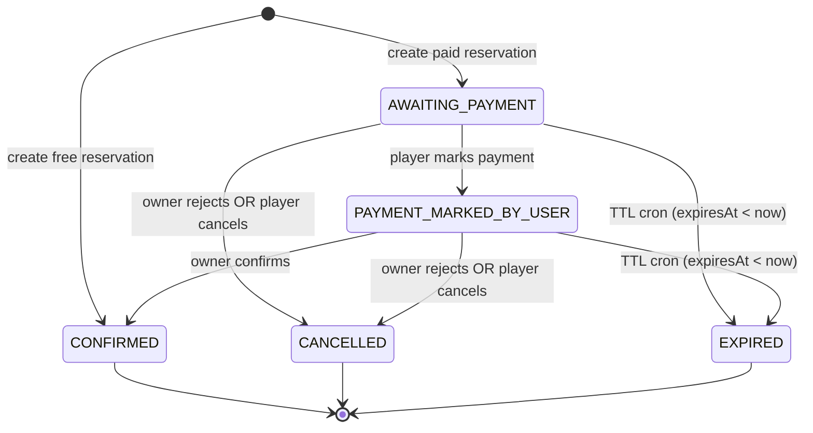
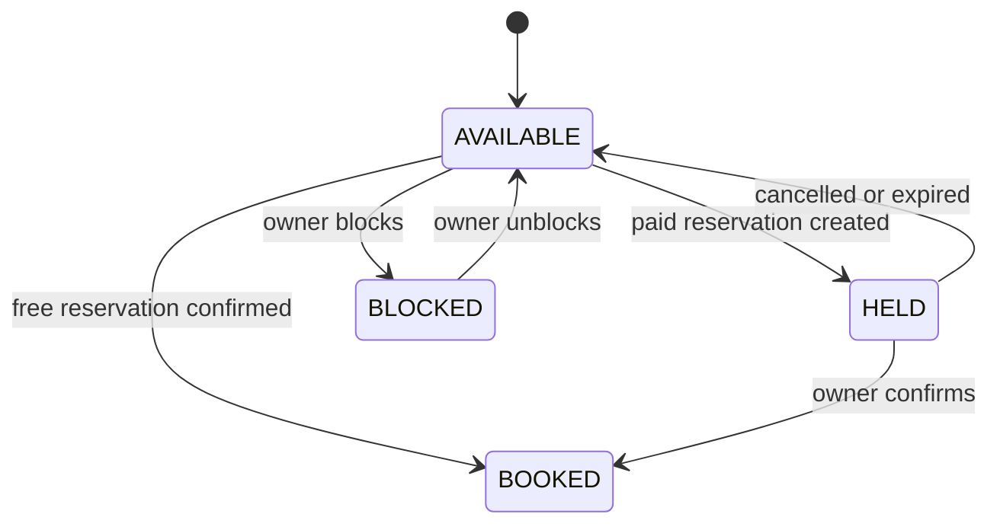

# Reservation State Machine (TTL)

## Overview
- Paid reservations use a 15-minute TTL window.
- Free reservations are confirmed immediately.
- Slot state transitions are coupled to reservation status.

## Levels of Detail
### Level 0 — One-minute summary
- Free bookings confirm immediately; paid bookings hold slots for 15 minutes.
- If payment is not confirmed within the TTL, the reservation expires.
- Expired or cancelled reservations release the slot back to availability.

### Level 1 — Product narrative
- Player selects a slot: free courts confirm instantly, paid courts start a countdown.
- Paid booking shows “Awaiting payment” and then “Awaiting confirmation” after payment is marked.
- Owner manually confirms payment; rejection or timeout frees the slot.

### Level 2 — Engineering states
- **Reservation statuses**
  - `AWAITING_PAYMENT`: paid reservation created; `expiresAt` is set.
  - `PAYMENT_MARKED_BY_USER`: player marked payment; owner must confirm.
  - `CONFIRMED`: free booking or owner-confirmed paid booking.
  - `CANCELLED`: player cancelled or owner rejected before confirmation.
  - `EXPIRED`: TTL expired via cron.
  - `CREATED`: enum value defined but not used in current flow.
- **Key transitions**
  - `AWAITING_PAYMENT` → `PAYMENT_MARKED_BY_USER` (player marks payment).
  - `AWAITING_PAYMENT` → `CANCELLED` (player cancel or owner reject).
  - `AWAITING_PAYMENT` → `EXPIRED` (TTL cron).
  - `PAYMENT_MARKED_BY_USER` → `CONFIRMED` (owner confirms).
  - `PAYMENT_MARKED_BY_USER` → `CANCELLED` (player cancel or owner reject).
  - `PAYMENT_MARKED_BY_USER` → `EXPIRED` (TTL cron).

### Level 3 — Automation & ops
- Cron runs every minute (`* * * * *`) via Vercel.
- Expiration rule: `expiresAt < now` and status in `AWAITING_PAYMENT`, `PAYMENT_MARKED_BY_USER`.
- Expiration updates reservation → `EXPIRED`, slot → `AVAILABLE`, audit event → `SYSTEM`.
- `CRON_SECRET` can be required for cron access.

## Current Diagram (from agent-contexts)
```
┌─────────────────────────────────────────────────────────────┐
│                    FREE COURT BOOKING                        │
├─────────────────────────────────────────────────────────────┤
│  Player → Select Free Slot → Reserve                         │
│     ↓                                                        │
│  Reservation: CONFIRMED                                      │
│  Slot: AVAILABLE → BOOKED                                    │
│  ✅ Done (immediate confirmation)                            │
└─────────────────────────────────────────────────────────────┘

┌─────────────────────────────────────────────────────────────┐
│                    PAID COURT BOOKING                        │
├─────────────────────────────────────────────────────────────┤
│  Player → Select Paid Slot → Reserve                         │
│     ↓                                                        │
│  Reservation: AWAITING_PAYMENT (expiresAt = NOW() + 15min)  │
│  Slot: AVAILABLE → HELD                                      │
│     ↓                                                        │
│  [15-Min Window]                                             │
│     ↓                                                        │
│  Player → /reservations/[id]/payment                         │
│     → Enter reference/notes                                  │
│     → Accept T&C                                             │
│     → "I Have Paid"                                          │
│     ↓                                                        │
│  Reservation: PAYMENT_MARKED_BY_USER                         │
│  Slot: HELD (unchanged)                                      │
│     ↓                                                        │
│  Owner → /owner/reservations → View pending                  │
│     → Confirm Payment                                        │
│     ↓                                                        │
│  Reservation: CONFIRMED                                      │
│  Slot: HELD → BOOKED                                         │
│  ✅ Done                                                     │
│                                                              │
│  ⏱️ TTL Expiration (if 15 min passes):                      │
│     Cron job (every minute)                                  │
│     → Reservation: EXPIRED                                   │
│     → Slot: HELD → AVAILABLE                                 │
│     → Audit event (SYSTEM role)                              │
└─────────────────────────────────────────────────────────────┘
```

## State Diagram (Reservation Status)


## Time Slot State Diagram


## State Transitions & TTL Rules
- Paid reservations set `expiresAt = now + 15 minutes` and start at `AWAITING_PAYMENT`.
- TTL window is fixed from creation; marking payment does not extend `expiresAt`.
- Marking payment is allowed only for `AWAITING_PAYMENT` and only before `expiresAt`.
- Owner confirmation transitions `PAYMENT_MARKED_BY_USER` → `CONFIRMED`.
- Owner rejection is allowed for `AWAITING_PAYMENT` or `PAYMENT_MARKED_BY_USER`.
- Player cancellation is allowed before `CONFIRMED` and moves to `CANCELLED`.
- Cron runs every minute to expire `AWAITING_PAYMENT` and `PAYMENT_MARKED_BY_USER` when `expiresAt < now`.
- Audit events are recorded for each transition, with `SYSTEM` as the role for cron expirations.

## Time Slot Coupling
- `AVAILABLE` → `HELD` when paid reservation created.
- `HELD` → `BOOKED` on owner confirmation.
- `HELD` → `AVAILABLE` on expiration or cancellation.
- `AVAILABLE` → `BOOKED` when free reservation confirmed.
- `AVAILABLE` ↔ `BLOCKED` when owner blocks/unblocks slots.
- `BOOKED` has no automated release in current flow.

## Implementation References
- `agent-contexts/00-06-feature-implementation-status.md`
- `agent-contexts/00-01-kudoscourts-server.md`
- `src/modules/reservation/use-cases/create-paid-reservation.use-case.ts`
- `src/modules/reservation/services/reservation.service.ts`
- `src/modules/reservation/services/reservation-owner.service.ts`
- `src/app/api/cron/expire-reservations/route.ts`
- `src/shared/infra/db/schema/enums.ts`
