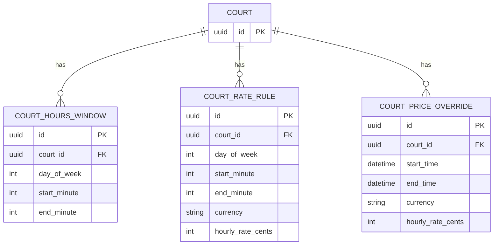
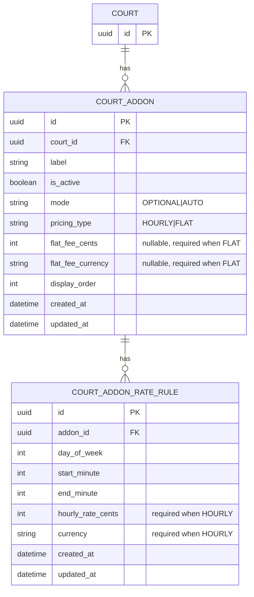

# Schedule & Pricing ERD (Current vs Add-ons)

Scope: this document covers court schedule (open hours) and pricing (base hourly rates + time overrides), and proposes an add-on schema aligned to `schedule-pricing-docs-v2.html`.

---

## (1) Current model (no add-ons)

The current pricing engine is driven by:
- `court_hours_window` (open/closed windows)
- `court_rate_rule` (base hourly pricing windows)
- `court_price_override` (timestamp-based hourly overrides)

### Current invariants
- Pricing is hourly: duration must be a multiple of 60.
- Every 60-minute segment must be covered by hours + base/override rate.
- Currency must be consistent across all segments.

---

## (2) Proposed add-ons model (v2-aligned)

Goal: support both add-on pricing types with one applicability table:
- `HOURLY` (segment-scoped, scales with duration)
- `FLAT` (booking-scoped one-time fee when any segment overlaps a rule window)

Modes:
- `OPTIONAL` (player-selected)
- `AUTO` (apply-when-ruled)
- `AUTO_STRICT` deferred (not in active enum now)

### New/changed tables
- `court_addon`
  - add-on definition and pricing type.
  - for `FLAT`, fee is stored here.
- `court_addon_rate_rule`
  - day/time applicability windows for add-ons.
  - for `HOURLY`, also carries `hourly_rate_cents`.
  - for `FLAT`, defines availability windows only.

### Constraints
- `day_of_week` in `0..6`.
- `start_minute` in `0..1439`, `end_minute` in `1..1440`, `start_minute < end_minute`.
- `HOURLY`: `hourly_rate_cents >= 0` and `currency` required.
- `FLAT`: `flat_fee_cents >= 0` and `flat_fee_currency` required.
- No overlaps per `addon_id` per day (service-layer validation, same pattern as `court_rate_rule`).
- Add-on currency (hourly or flat) must match base booking currency.

### Pricing semantics (selected)
- `AUTO` means apply-when-ruled.
- If a segment has no matching add-on rule window, add-on contribution is `+0` for that segment (no rejection).
- `FLAT` is charged once on first overlap with add-on rule windows.
- `AUTO_STRICT` is deferred and can be added later as an enum + engine check without schema redesign.

### Optional extension
- If needed, add one-off override tables mirroring `court_price_override`:
  - `court_addon_rate_override` for HOURLY add-ons
  - `court_addon_flat_override` for FLAT add-ons
