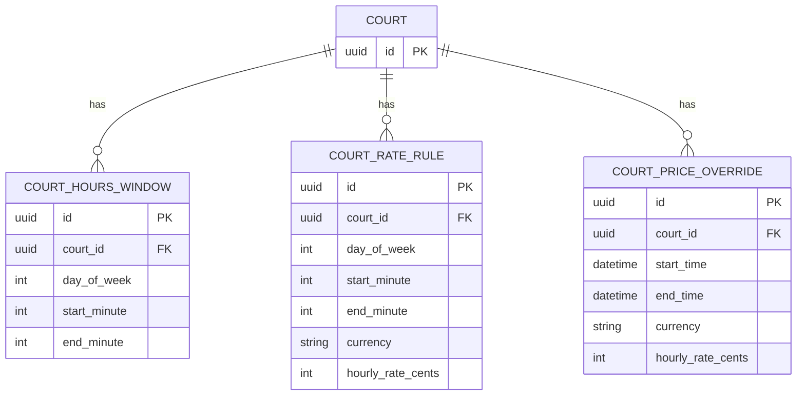
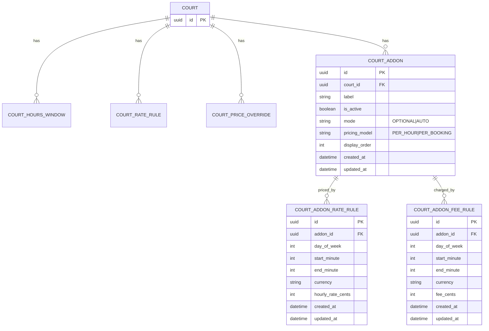

# Schedule & Pricing ERD (Current vs Add-ons)

Scope: this document covers **court schedule** (open hours) and **pricing** (base hourly rates + time-based overrides), and proposes an ERD to support **owner-defined add-ons** (label + price) that apply to specific court hours.

---

## (1) Current data model (no add-ons)

The pricing engine is currently driven by three tables:
- `court_hours_window` (is the court open?)
- `court_rate_rule` (what is the hourly rate in a given day/time window?)
- `court_price_override` (timestamp-range override that can replace the base rate)

### Current invariants (important constraints)
- **Hourly segmentation only:** pricing is computed in **60-minute segments**; duration must be a multiple of 60.
- **Coverage required:** for a slot to be priceable, every hour segment must be:
  - inside some `court_hours_window` for that day-of-week, and
  - covered by either a matching `court_rate_rule` window or a matching `court_price_override` range.
- **Currency consistency:** all segments must resolve to the same `currency` or pricing fails.
- **Overlaps:**
  - `court_hours_window` and `court_rate_rule` overlaps are prevented in the service layer (not by DB constraints).
  - `court_price_override` overlaps are not prevented; overlapping overrides are currently ambiguous unless you define a tie-breaker.

---

## (2) Proposed add-ons model (owner-defined label + price)

Goal: let an owner define add-ons (e.g. “Lights”) and attach add-on pricing to specific day/time windows, supporting **both**:
- **PER_HOUR** (segment-scoped hourly surcharges)
- **PER_BOOKING** (booking-scoped one-time fees)

Key design choice:
- Model add-on applicability/pricing windows like `court_rate_rule` (day-of-week + minute windows), so the pricing engine can stay “iterate 60-minute segments and sum”, and booking-fees can be triggered by segment overlap.

### New tables
- `court_addon`
  - defines the add-on (label, active, selection behavior, pricing model).
- `court_addon_rate_rule`
  - defines when the add-on is applicable and what it costs per hour for those windows (**PER_HOUR** add-ons only).
- `court_addon_fee_rule`
  - defines when the add-on is applicable and what it costs per booking for those windows (**PER_BOOKING** add-ons only).

### Proposed constraints (match existing schedule/pricing constraints)
- For both `court_addon_rate_rule` and `court_addon_fee_rule`:
  - `day_of_week` in `0..6`
  - `start_minute` in `0..1439`, `end_minute` in `1..1440`, and `start_minute < end_minute`
  - cents amount is non-negative (`hourly_rate_cents >= 0` / `fee_cents >= 0`)
  - Service-layer validation: **no overlaps per `addon_id` per day-of-week** (same pattern as `court_rate_rule`)
- Pricing rule: add-on `currency` must match the base slot currency (otherwise the pricing engine should fail the slot as “not priceable”).

### “How it plugs into pricing” (conceptually)
- Compute base price exactly as today.
- Determine applied add-ons (`AUTO` + player-selected `OPTIONAL`).
- For each applied add-on:
  - **PER_HOUR:** scan the same 60-minute segments and add `hourly_rate_cents` when a matching `court_addon_rate_rule` covers the segment.
  - **PER_BOOKING:** if any segment overlaps a matching `court_addon_fee_rule`, add `fee_cents` once for the booking (recommended: if multiple rules match, choose the **max** fee for that add-on to avoid double-charging).
- Add-on `mode`:
  - `OPTIONAL`: only applied if selected by the player.
  - `AUTO`: auto-applied when applicable by schedule rules (still modeled separately from base rates).

This keeps the schedule & pricing system **hourly**, **window-driven**, and consistent with the existing architecture.

### Selected semantics: “rule windows define applicability”
- Add-on rules are interpreted as “this add-on applies during these windows at this price”.
- If no rule covers a given 60-minute segment, the add-on **does not apply** to that segment (so it contributes **+0** for that segment), even for `AUTO`.

---

## Notes / open questions (schedule & pricing only)
- If you want one-off add-on pricing (like holiday lights pricing), add timestamp-range override tables mirroring `court_price_override`:
  - `court_addon_rate_override` (for **PER_HOUR**)
  - `court_addon_fee_override` (for **PER_BOOKING**)
  - and define deterministic precedence to avoid overlap ambiguity.
