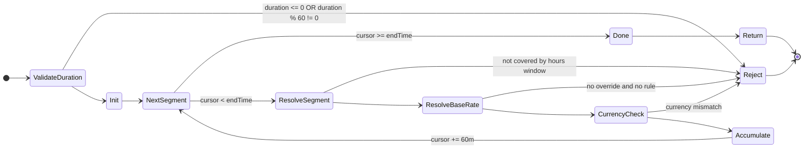
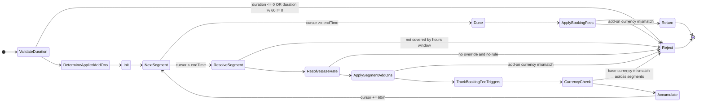

# Schedule & Pricing State Machines (Current vs Add-ons)

Scope: this document models the **pricing evaluation** flow used by schedule/availability. It intentionally omits reservation/payment lifecycle.

References:
- Base pricing: `/Users/raphaelm/Documents/Coding/boilerplates/next16bp/src/lib/shared/lib/schedule-availability.ts`
- Slot generation: `/Users/raphaelm/Documents/Coding/boilerplates/next16bp/src/lib/modules/availability/services/availability.service.ts`

---

## (1) Current: base slot pricing (no add-ons)

This reflects the behavior of `computeSchedulePrice()`:
- Validate duration (hourly only)
- Iterate in 60-minute segments
- Require hours coverage + rate coverage for every segment
- Enforce single currency across the slot

---

## (2) Proposed: base pricing + applied add-ons (PER_HOUR + PER_BOOKING)

This extends the state machine to include **owner-defined add-ons** that can be:
- `AUTO`: always applied
- `OPTIONAL`: applied only when selected
- `PER_HOUR`: segment-scoped hourly surcharge
- `PER_BOOKING`: booking-scoped one-time fee (triggered by overlap with a fee rule)

For each 60-minute segment:
- Compute the base rate exactly as today.
- Apply **PER_HOUR** add-on surcharges when a matching add-on rule covers the segment.
- Track whether any **PER_BOOKING** add-on fee rule is “triggered” by segment overlap.
- Reject if an applied add-on attempts to introduce a currency mismatch.

### Notes (selected semantics)
- `PER_BOOKING` overlap rule: recommended is “apply once per add-on if **any** segment overlaps a fee rule; if multiple rules match, take the **max** fee for that add-on.”
- `AUTO` + missing rule behavior (example):
  - Add-on: **Lights** (`AUTO`, `PER_HOUR`), rule only for 18:00–22:00 (+200/hour).
  - Booking: 17:00–19:00 (two 60-minute segments: 17–18, 18–19).
    - **Reject slot** approach: booking becomes “not priceable” because segment 17–18 has no lights rule, so the slot disappears from availability.
    - **$0 outside window** approach: segment 17–18 adds +0, segment 18–19 adds +200; booking is priceable and the surcharge matches the configured “lights hours”.
  - Selected behavior: treat add-on rules as **both applicability + price**. If no rule covers a segment, the add-on simply **does not apply** to that segment (so +$0), even if `AUTO`.
