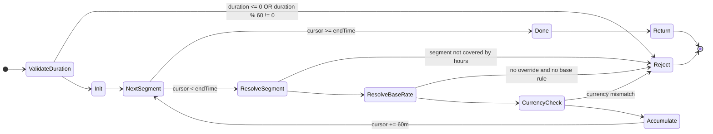
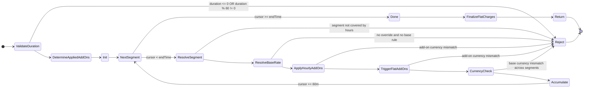

# Schedule & Pricing State Machines (Current vs Add-ons)

Scope: this document models pricing evaluation for schedule/availability only.

References:
- Base pricing: `/Users/raphaelm/Documents/Coding/boilerplates/next16bp/src/lib/shared/lib/schedule-availability.ts`
- Slot generation: `/Users/raphaelm/Documents/Coding/boilerplates/next16bp/src/lib/modules/availability/services/availability.service.ts`

---

## (1) Current flow: base slot pricing

---

## (2) Proposed v2 flow: base pricing + add-ons

Add-ons are evaluated from a single set of add-on rules:
- `pricing_type = HOURLY`: add per covered segment.
- `pricing_type = FLAT`: charge once on first overlap with a rule window.

Mode semantics:
- `OPTIONAL`: only if player selected.
- `AUTO`: apply-when-ruled.
- `AUTO_STRICT`: deferred.

### Selected semantics
- If no add-on rule covers a segment, that add-on contributes `+0` for that segment.
- `AUTO` never rejects due to missing add-on coverage; it applies only where rules match.
- `FLAT` charges once per add-on when the first segment overlap occurs.
- `AUTO_STRICT` is deferred and intentionally not part of current behavior.
