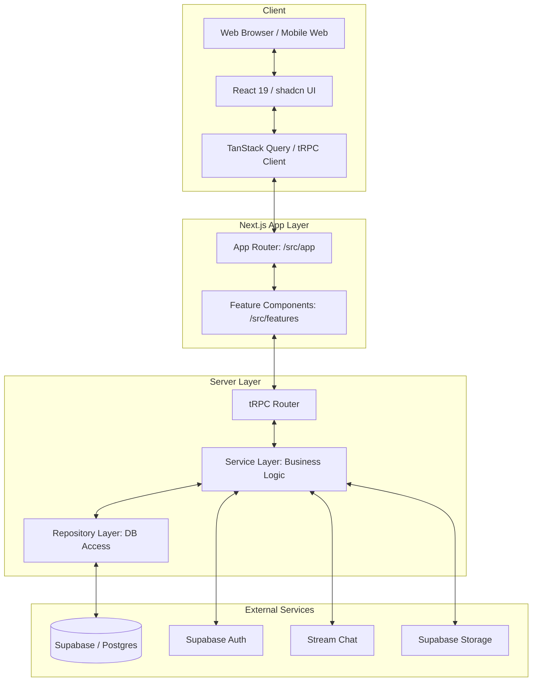

# Architecture Specification

> Manually analyzed and updated on 2026-02-21

## Purpose

This document describes the architectural patterns, structural layers, and data flow of the KudosCourts platform.

## Architecture Style

The system follows a **Modular Feature-based Architecture** on the frontend and a **Layered Service-Oriented Architecture** on the backend, all integrated within the Next.js App Router framework.

## Requirements

- **Type Safety**: End-to-end type safety using TypeScript and tRPC.
- **Modularity**: Domain logic isolated into features to prevent tight coupling.
- **Consistency**: Centralized error handling, formatting, and time-zone management.
- **Scalability**: Stateless server logic with Supabase/Postgres for persistence.

## System Diagram

## Layer Structure

- **App Layer (`src/app`)**: Responsible for routing, layouts, and page-level data fetching/coordination.
- **Feature Layer (`src/features`)**: Contains self-contained domain modules (e.g., `discovery`, `reservation`). Each feature includes its own components, hooks, and client-side API definitions.
- **Library Layer (`src/lib`)**:
    - **Modules (`src/lib/modules`)**: Server-only domain logic following the Repository/Service pattern.
    - **Shared (`src/lib/shared`)**: Cross-cutting infrastructure like auth, logging, and ratelimiting.
- **Common Layer (`src/common`)**: Pure utility functions, types, and constants safe for both client and server runtime.
- **Database Layer (`drizzle`)**: Drizzle schema definitions, migrations, and seed scripts.

## Data Flow

1. **Request**: User interaction triggers a tRPC mutation or query from a React component.
2. **Transport**: tRPC handles the request with full type safety, routing it to the appropriate server-side procedure.
3. **Validation**: Zod schemas validate the input at the router level.
4. **Execution**: The router calls a Service Use Case, which coordinates domain logic and multiple repository calls.
5. **Persistence**: Repositories interact with Postgres via Drizzle ORM.
6. **Response**: Data is returned through the layers, narrowed by Zod, and updated in the client-side TanStack Query cache.
