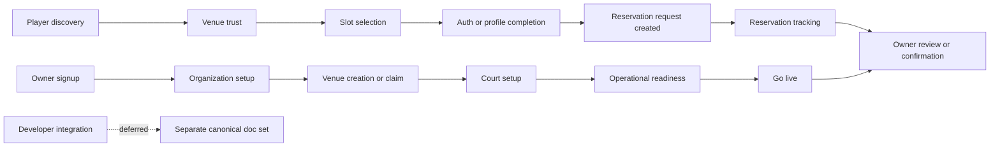

# Research Plan

## Goal

Define the first-wave Playwright E2E coverage for KudosCourts core user journeys, limited to player and owner/organization flows. Developer integration coverage is explicitly deferred.

## Inputs Reviewed

- `src/features/guides/content/guides.ts`
- `important/core-features/00-overview.md`
- `important/core-features/13-user-flow-maps.md`
- `tests/e2e/owner-get-started.happy-path.spec.ts`
- `tests/e2e/player-reserve-single-slot.awaiting-owner-confirmation.spec.ts`

## Early Findings

- The current public narrative makes player discovery and booking the primary outside-in journey.
- The current public narrative makes owner listing setup and onboarding the primary owner journey before deeper operations.
- Developer integration has its own canonical doc set and should not be part of the first test wave.
- The repo already has one owner get-started E2E and one player single-slot reservation E2E, so first-wave planning should distinguish between extending existing coverage and adding missing core-path scenarios.

## Proposed Research Tracks

1. Extract the canonical player and owner promises from `guides.ts`.
2. Cross-reference those promises against `important/core-features/*` to capture implementation-level steps, drop-off points, and critical path transitions.
3. Inventory current Playwright coverage and helpers to identify what is already tested, what is reusable, and what core gaps remain.
4. Produce a first-wave E2E shortlist for org/player journeys only, with explicit deferrals for developer integrations and lower-priority operational flows.

## Initial Journey Model

## Questions This Research Should Answer

- Which player journey should be the first must-pass Playwright scenario: discovery-to-booking, booking-to-tracking, or booking-to-owner-confirmation?
- Which owner journey should be the first must-pass Playwright scenario: onboarding wizard completion, listing discoverability, or reservation handling?
- Which steps are already covered by existing E2E specs, and which steps are still uncovered but critical enough for the first wave?
