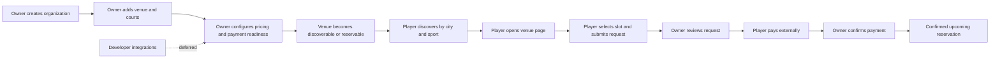

# Journey Evidence

## Scope

This note extracts the canonical first-wave user journeys from the current public guides and the internal core-feature docs.

## What The Public Narrative Optimizes For

The current guide set is audience-specific:

- `players` are guided from discovery to booking and reservation tracking.
- `owners` are guided from organization setup to operational readiness and real booking handling.
- `developers` have a separate canonical guide and are out of scope for this effort.

That split is explicit in `src/features/guides/content/guides.ts`, where the key first-wave guide entries are:

- player booking: `how-to-book-a-sports-court-on-kudoscourts`
- owner onboarding: `how-to-set-up-your-sports-venue-organization-on-kudoscourts`
- developer API guide: separate and deferred

## Player Journey Evidence

The player path is not only “book a court.” The docs make discovery part of the same conversion chain:

1. Start with a city-and-sport discovery surface.
2. Build a shortlist from relevant venues.
3. Open a venue page for trust signals.
4. Check availability when present.
5. Select a slot.
6. Survive auth handoff without losing booking context.
7. Complete required profile fields.
8. Submit the reservation request.
9. Track it in reservation detail and `My Reservations`.
10. Continue through payment and owner confirmation when applicable.

Evidence:

- `important/core-features/01-discovery-and-booking.md`
- `important/core-features/02-reservation-lifecycle.md`
- `important/core-features/11-accounts-and-profiles.md`
- `important/core-features/13-user-flow-maps.md`

## Owner Journey Evidence

The owner path is also a single go-live journey rather than isolated setup screens:

1. Create organization.
2. Add or claim venue.
3. Add courts.
4. Configure schedule and pricing.
5. Add payment method.
6. Submit verification.
7. Turn on notifications.
8. Invite team.
9. Handle reservations and go live.

Important nuance: the guide narrative expects notifications and team access to be part of going live, but the current UX still surfaces some of that later and less cleanly.

Evidence:

- `important/core-features/03-venue-and-court-management.md`
- `important/core-features/04-owner-onboarding.md`
- `important/core-features/06-notification-system.md`
- `important/core-features/12-gap-analysis.md`
- `important/core-features/13-user-flow-maps.md`

## Research Conclusion

The minimum first-wave E2E coverage should follow the real product loop, not isolated pages:

- owner readiness
- player discovery to reservation creation
- paid reservation completion

Developer integration should remain deferred because `important/core-features/00-overview.md` explicitly treats it as a separate canonical doc set.

## Product Loop

## Sources

- `src/features/guides/content/guides.ts`
- `important/core-features/00-overview.md`
- `important/core-features/01-discovery-and-booking.md`
- `important/core-features/02-reservation-lifecycle.md`
- `important/core-features/03-venue-and-court-management.md`
- `important/core-features/04-owner-onboarding.md`
- `important/core-features/06-notification-system.md`
- `important/core-features/11-accounts-and-profiles.md`
- `important/core-features/12-gap-analysis.md`
- `important/core-features/13-user-flow-maps.md`
