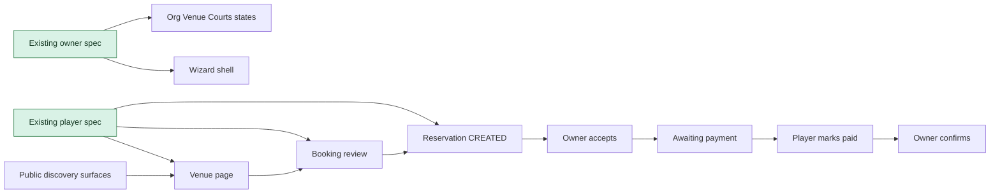

# Current E2E Surface

## Scope

This note records what the repository can already test with Playwright and where the current E2E surface stops short of the full product journey.

## Existing Playwright Setup

- Test command: `pnpm test:e2e`
- Config file: `playwright.config.ts`
- Browser coverage: Chromium only
- Base URL: `E2E_BASE_URL` or `http://localhost:3000`
- Existing credentials model:
  - `E2E_OWNER_EMAIL`
  - `E2E_OWNER_PASSWORD`
  - `E2E_PLAYER_EMAIL`
  - `E2E_PLAYER_PASSWORD`
  - `E2E_PLAYER_VENUE_SLUG`

## Existing Specs

| Spec | What It Covers | Current Limitation |
|------|----------------|-------------------|
| `tests/e2e/owner-get-started.happy-path.spec.ts` | Wizard access, org/venue/courts creation states, skippable-step rendering, back navigation | Does not drive schedule/pricing, payment methods, verification submission, notification enablement, dashboard handoff, or first booking handling |
| `tests/e2e/player-reserve-single-slot.awaiting-owner-confirmation.spec.ts` | Venue page booking flow, auth handoff, profile completion prompt, terms gate, reservation detail in `CREATED` | Starts from a specific venue, skips public discovery, does not assert `My Reservations`, owner review, payment, or confirmation |

## What The Current Test Surface Suggests

- The repo already proves that the owner wizard and player single-slot booking are testable with credential-based flows.
- The current coverage stops exactly where the product docs say the larger loop continues:
  - player flow stops at `CREATED`
  - owner flow stops before operational readiness and reservation review
- There is no current cross-actor orchestration for player-owner lifecycle progression in the E2E suite.

## Testability Constraints Observed

- Existing helpers are single-actor and credential-driven.
- Player coverage depends on a known venue slug with at least one selectable slot.
- The owner happy-path spec avoids brittle completion requirements by accepting “complete or create” states for early wizard steps and only checking visibility for skippable later steps.
- The product docs treat notification activation as go-live critical, but `important/core-features/12-gap-analysis.md` says there is no dedicated in-wizard notification activation step yet. Any first-wave test should model the current implementation, not the aspirational guide copy.

## Coverage Boundary Map

## Research Conclusion

The repository is already positioned for two first-wave extensions:

- expand player coverage backward into discovery
- expand owner coverage forward into operational readiness

The third core journey, paid reservation completion, is product-critical but will need more deliberate actor coordination and fixture assumptions than the current suite uses.

## Sources

- `playwright.config.ts`
- `package.json`
- `tests/e2e/owner-get-started.happy-path.spec.ts`
- `tests/e2e/player-reserve-single-slot.awaiting-owner-confirmation.spec.ts`
- `tests/e2e/helpers/auth-login.ts`
- `tests/e2e/helpers/player-auth.ts`
- `important/core-features/12-gap-analysis.md`
