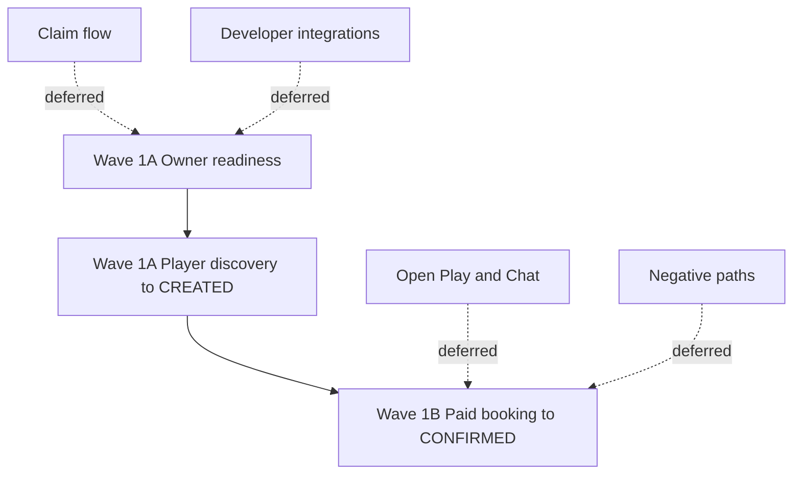

# First-Wave Shortlist

## Recommendation

First-wave Playwright E2E coverage should focus on three journeys, in this order:

1. owner onboarding to operational readiness
2. player discovery to pending reservation
3. paid reservation completion

## Why These Three

### 1. Owner Onboarding To Operational Readiness

This is the owner-controlled prerequisite for the rest of the booking loop. Without organization setup, a venue, courts, pricing, and payment readiness, player booking either cannot happen or cannot complete end to end.

Important nuance: current UX does not yet include a clean in-wizard notification activation step, so the research recommendation is to test current go-live behavior rather than idealized future UX.

### 2. Player Discovery To Pending Reservation

This is the top-of-funnel player conversion path described by the guides. The current E2E suite starts at a specific venue page, which misses the public discovery promise that the guides now emphasize.

### 3. Paid Reservation Completion

This is not an edge case. The docs describe manual or offline payment as the standard current booking model, so the first serious E2E plan should include the paid lifecycle from owner acceptance to player payment proof to owner confirmation.

## Proposed Wave Structure

| Wave | Journey | Suggested Outcome |
|------|---------|-------------------|
| 1A | Owner onboarding to operational readiness | Owner reaches a real “ready to receive bookings” state based on current UX |
| 1A | Player discovery to pending reservation | Player starts from public browse, submits a request, and finds it under pending tracking surfaces |
| 1B | Paid reservation completion | Player and owner progress the same reservation from `CREATED` to `CONFIRMED` through the manual payment flow |

## Explicit Deferrals

- developer API and system-to-system integrations
- claim-existing-venue path and admin approval timing
- team invites and granular permissions
- notification channel matrix permutations
- open play and reservation chat
- negative booking branches such as reject, cancel, expire
- free-booking shortcut and group-booking variants
- discovery-only outcomes such as saved venues and bookmarking

## Prioritization Diagram

## Research Conclusion

If the goal is “core user journeys first,” then the current suite should not stop at the two existing happy-path fragments. It should be planned as one owner-player loop with a staged rollout:

- make the venue operational
- let a player find and request it
- complete the current paid reservation model

## Sources

- `important/core-features/00-overview.md`
- `important/core-features/01-discovery-and-booking.md`
- `important/core-features/02-reservation-lifecycle.md`
- `important/core-features/03-venue-and-court-management.md`
- `important/core-features/04-owner-onboarding.md`
- `important/core-features/06-notification-system.md`
- `important/core-features/09-payments.md`
- `important/core-features/11-accounts-and-profiles.md`
- `important/core-features/12-gap-analysis.md`
- `important/core-features/13-user-flow-maps.md`
- `tests/e2e/owner-get-started.happy-path.spec.ts`
- `tests/e2e/player-reserve-single-slot.awaiting-owner-confirmation.spec.ts`
