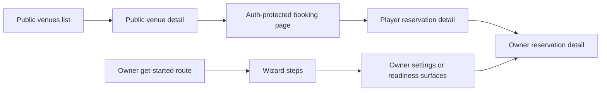

# Implementation Surface Map

## Goal

Map the main route boundaries and feature modules involved in the recommended first-wave journeys.

## Route Boundaries

### Owner Onboarding

- Route: `src/app/(owner)/organization/get-started/page.tsx`
- Page module: `src/features/owner/pages/owner-get-started-page.tsx`
- Client module: `src/features/owner/components/owner-get-started-page-client.tsx`
- Wizard modules:
  - `src/features/owner/components/get-started/wizard/setup-wizard.tsx`
  - `src/features/owner/components/get-started/wizard/steps/org-step.tsx`
  - `src/features/owner/components/get-started/wizard/steps/venue-step.tsx`
  - `src/features/owner/components/get-started/wizard/steps/courts-step.tsx`
  - `src/features/owner/components/get-started/wizard/steps/config-step.tsx`
  - `src/features/owner/components/get-started/wizard/steps/payment-step.tsx`
  - `src/features/owner/components/get-started/wizard/steps/verify-step.tsx`
  - `src/features/owner/components/get-started/wizard/steps/complete-step.tsx`

### Player Discovery

- Route: `src/app/(public)/venues/page.tsx`
- Page module: `src/features/discovery/pages/courts-page.tsx`
- Client module: `src/features/discovery/components/courts-page-client.tsx`

### Player Venue Detail

- Route: `src/app/(public)/venues/[placeId]/page.tsx`
- Page module: `src/features/discovery/pages/place-detail-page.tsx`
- View module: `src/features/discovery/place-detail/components/place-detail-page-view.tsx`

### Player Booking

- Route: `src/app/(auth)/venues/[placeId]/book/page.tsx`
- Page module: `src/features/reservation/pages/place-booking-page.tsx`

### Player Reservation Tracking

- Route list:
  - `src/app/(auth)/reservations/page.tsx`
  - `src/app/(auth)/reservations/[id]/page.tsx`
- Detail page module: `src/features/reservation/pages/reservation-detail-page.tsx`

### Owner Reservation Review

- Route list:
  - `src/app/(owner)/organization/reservations/page.tsx`
  - `src/app/(owner)/organization/reservations/active/page.tsx`
  - `src/app/(owner)/organization/reservations/[id]/page.tsx`
- Detail page module: `src/features/owner/pages/owner-reservation-detail-page.tsx`

## Supporting Owner Surfaces Relevant To First-Wave Tests

- notification routing component: `src/features/owner/components/reservation-notification-routing-settings.tsx`
- payment method management overlay: `src/features/owner/components/get-started/overlays/manage-payment-methods-sheet.tsx`
- owner settings route: `src/app/(owner)/organization/settings/page.tsx`

## Research Conclusion

The recommended journeys are not isolated to one route each:

- owner readiness spans the wizard plus later owner settings and dashboard-adjacent readiness surfaces
- player booking spans public discovery, public venue detail, auth-protected booking, and reservation tracking
- paid completion spans both the player reservation detail route and the owner reservation detail route

That means a single “core user journey” spec may legitimately cross route groups and feature modules. Planning should account for that rather than assuming one page per journey.

## Surface Relationship Map

## Sources

- `src/app/(owner)/organization/get-started/page.tsx`
- `src/app/(public)/venues/page.tsx`
- `src/app/(public)/venues/[placeId]/page.tsx`
- `src/app/(auth)/venues/[placeId]/book/page.tsx`
- `src/app/(auth)/reservations/page.tsx`
- `src/app/(auth)/reservations/[id]/page.tsx`
- `src/app/(owner)/organization/reservations/page.tsx`
- `src/app/(owner)/organization/reservations/active/page.tsx`
- `src/app/(owner)/organization/reservations/[id]/page.tsx`
- `src/app/(owner)/organization/settings/page.tsx`
- `src/features/discovery/pages/courts-page.tsx`
- `src/features/discovery/pages/place-detail-page.tsx`
- `src/features/reservation/pages/place-booking-page.tsx`
- `src/features/reservation/pages/reservation-detail-page.tsx`
- `src/features/owner/pages/owner-get-started-page.tsx`
- `src/features/owner/pages/owner-reservation-detail-page.tsx`
- `src/features/owner/components/reservation-notification-routing-settings.tsx`
- `src/features/owner/components/get-started/overlays/manage-payment-methods-sheet.tsx`
